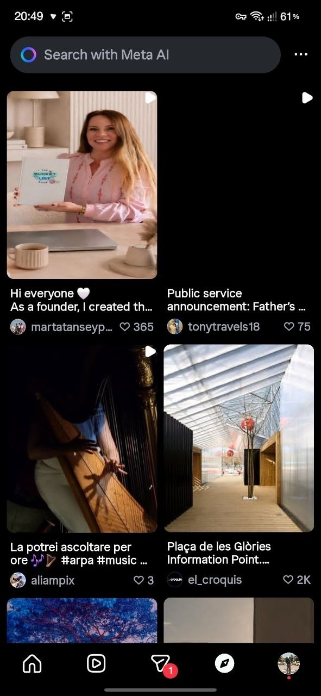
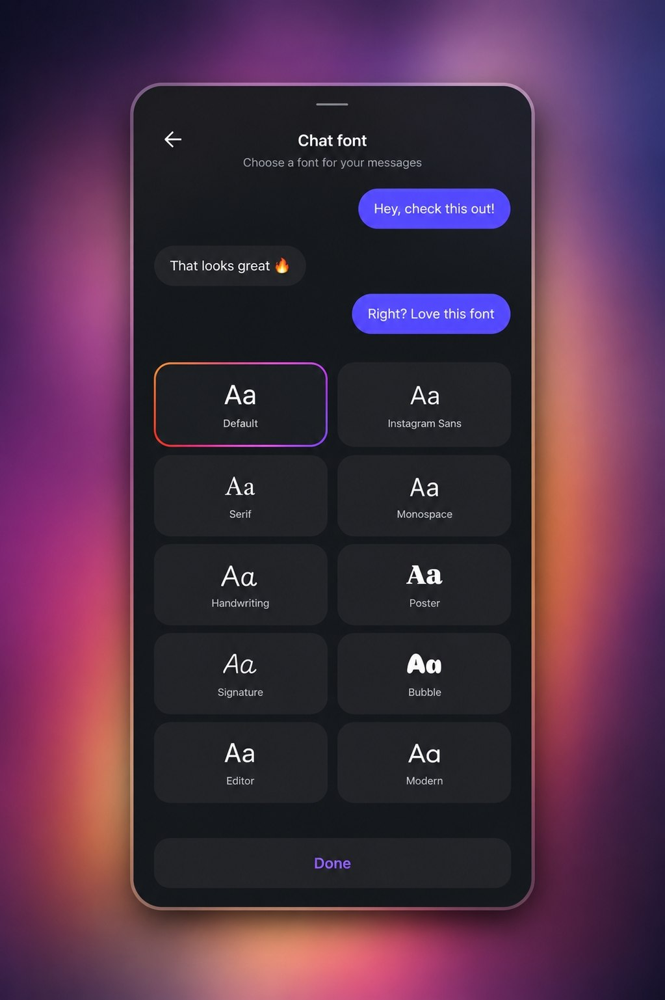
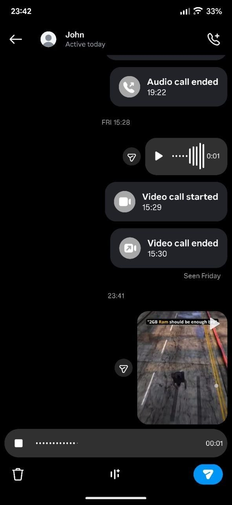

# 📱 Yet Another Dani and Community's Guide!
⚠️ SOME FLAGS COULD HAVE A MISLEADING SETTING, ENABLED WHEN IT IS SUPPOSED TO BE DISABLED, REPORT THIS IN THE OFFICIAL SERVER

Welcome to the official continuation of the legendary **Community's Ultimate Guide by John and Dani**! 

This is a community-driven project dedicated to tracking and documenting changes in Instagram's Android alpha versions by analyzing internal feature flags (GKs/QEs) from Metaconfig. Updates are automatically published to our Telegram channel via a self-hosted bot, built and maintained by the community.

## 🤝 Built by the Community, for the Community
**Attention! This is a living document.**
The guide has fully transitioned to a **community-supported version**. This means that any user in the **Instagram Developer Community** can contribute to expanding and improving it. By opening the guide to community collaboration, everyone has the opportunity to share their insights, discovered features, and updates. Together, we can create a comprehensive and up-to-date resource, ensuring the best experience for everyone!

---

## ⚙️ How it works
* Instagram alpha APKs are analyzed for changes in internal flags.
* Additions, removals, and updates are carefully documented and categorized.
* A Telegram bot automatically publishes each new changelog entry.
* The community contributes flag descriptions, testing, and feature context.

## 🔗 Resources
* 📢 **Telegram Channel:** [igdevdani](https://t.me/igdevdani)
* 🤝 **Contributing:** See the FAQ and community guidelines to start submitting your findings.

---

## ❓ FAQ (Frequently Asked Questions)

**I can't access the Developer Settings!**
> Make sure you have gone into *MetaConfig Settings and Overrides*—that is where all the flags are located.

**I don't see the Developer Settings when holding the home icon.**
> This only works for Instagram Mods that have the Developer Options enabled. It's not available on the stock Instagram app, as it is normally restricted to developers only.

**A flag is not working.**
> Check your base version. If you are on a supported base, the flag might be region-locked, available only to limited accounts (A/B testing), server-sided, or it has stopped working completely. If it has been completely removed or broken, the flag will eventually be moved to our Archive category.

**Instagram is crashing!**
> You have enabled a faulty flag (a flag that causes issues with some features or the core app). If this happens with a flag listed in our guide regarding new features, please kindly inform us so we can update it. Otherwise, we are not responsible for random crashes. To fix your app, clear the app data and start adding your flags all over again.

**I need support!**
> Send a message in the Patreon chat to get assistance from the team.

**Why don't flags added before the 305.0.0.0.107 base mention their specific version?**
> We use a mapping database for flag information configured specifically for bases from `305.0.0.0.107` and beyond. Because we cannot feasibly search all previous bases for historical flags (it would take forever), we simply use the label *"Added in version 305.0.0.0.107 or earlier"* for those older entries.


- [Important](#important)
  - [Disable Thread posts in the feed](#disable-thread-posts-in-the-feed)
  - [Enable the shake phone to report a problem sheet even if you disabled it](#enable-the-shake-phone-to-report-a-problem-sheet-even-if-you-disabled-it)
  - [Make the app more efficient](#make-the-app-more-efficient)
  - [Messenger update](#messenger-update)
  - [Prevent Instagram from taking lots of space in app data](#prevent-instagram-from-taking-lots-of-space-in-app-data)
  - [Remove the reel ads and improve/fix adblocking in Instagram mods](#remove-the-reel-ads-and-improvefix-adblocking-in-instagram-mods)
  - [Remove the story ads with the "LEARN MORE" stickers inside](#remove-the-story-ads-with-the-learn-more-stickers-inside)
  - [Remove Threads usernames and button](#remove-threads-usernames-and-button)
  - [Remove the Google Play update dialog](#remove-the-google-play-update-dialog)
- [Quality](#quality)
  - [High quality video uploads on stories and reels](#high-quality-video-uploads-on-stories-and-reels)
  - [Improve quality of posts](#improve-quality-of-posts)
  - [Reduce compression of photo uploads in the feed](#reduce-compression-of-photo-uploads-in-the-feed)
  - [Upload photos up to 1440p resolution in stories](#upload-photos-up-to-1440p-resolution-in-stories)
  - [4K Quality Command](#4k-quality-command)
  - [Enable 48khz sample rate](#enable-48khz-sample-rate)
  - [Enable stereo](#enable-stereo)
- [UI](#ui)
  - [Redesign of the Message Requests](#redesign-of-the-message-requests)
  - [Variations of the Reel uploading section](#variations-of-the-reel-uploading-section)
  - [Accessibility settings](#accessibility-settings)
  - [Album picker](#album-picker)
  - [Android widget](#android-widget)
  - [Call screen redesign](#call-screen-redesign)
  - [Change activity icon to bell icon](#change-activity-icon-to-bell-icon)
  - [Channels tab](#channels-tab)
  - [Content languages](#content-languages)
  - [Creator support option in Settings](#creator-support-option-in-settings)
  - [Customize buttons layout](#customize-buttons-layout)
  - [Direct new icon](#direct-new-icon)
  - [Fundraiser redesign](#fundraiser-redesign)
  - [Media previews in stories](#media-previews-in-stories)
  - [Merge a lot of actions into a Plus button in the Direct chat list](#merge-a-lot-of-actions-into-a-plus-button-in-the-direct-chat-list)
  - [Merge audio and video call icons together and get an info button in chats](#merge-audio-and-video-call-icons-together-and-get-an-info-button-in-chats)
  - [More details about broadcast channels on the search section in Direct](#more-details-about-broadcast-channels-on-the-search-section-in-direct)
  - [Move the Alt Text option from the Advanced Settings to the normal ones](#move-the-alt-text-option-from-the-advanced-settings-to-the-normal-ones)
  - [Multiple comment tabs](#multiple-comment-tabs)
  - [Music picker as the default post editing option with a redesigned appearance](#music-picker-as-the-default-post-editing-option-with-a-redesigned-appearance)
  - [New apperance of reactions](#new-apperance-of-reactions)
  - [New dark mode](#new-dark-mode)
  - [New filters icon](#new-filters-icon)
  - [New loading screen](#new-loading-screen)
  - [New pip mode for audio calls](#new-pip-mode-for-audio-calls)
  - [New stories stickers menu design](#new-stories-stickers-menu-design)
  - [New swipe to camera animation](#new-swipe-to-camera-animation)
  - [Redesign of the media picker in Direct](#redesign-of-the-media-picker-in-direct)
  - [Redesign of the media previews of stories](#redesign-of-the-media-previews-of-stories)
  - [Redesign of the media reordering on the carousel post editor](#redesign-of-the-media-reordering-on-the-carousel-post-editor)
  - [Redesign of the message actions in Direct](#redesign-of-the-message-actions-in-direct)
  - [Redesign of the post editing section](#redesign-of-the-post-editing-section)
  - [Redesign of the reaction counter animation in Direct](#redesign-of-the-reaction-counter-animation-in-direct)
  - [Redesign of the search bar in Direct](#redesign-of-the-search-bar-in-direct)
  - [Redesign of the search section in Direct](#redesign-of-the-search-section-in-direct)
  - [Redesign of the text creator in Reels editor](#redesign-of-the-text-creator-in-reels-editor)
  - [Redesign of the Text to Speech picker in Reels editor](#redesign-of-the-text-to-speech-picker-in-reels-editor)
  - [Redesigned comment section](#redesigned-comment-section)
  - [Reel view counts in the profile and redesign of the existing ones in the Reels tab](#reel-view-counts-in-the-profile-and-redesign-of-the-existing-ones-in-the-reels-tab)
  - [Save Draft button in post publishing section](#save-draft-button-in-post-publishing-section)
  - [Show live in direct panel](#show-live-in-direct-panel)
  - [Thick story ring](#thick-story-ring)
  - [Timestamps](#timestamps)
  - [Story Interest Signals](#story-interest-signals)
  - [Minimal Overflow Menu Icon](#minimal-overflow-menu-icon)
  - [Story Upload Progress Percentage](#story-upload-progress-percentage)
  - [Note Likes UI](#note-likes-ui)
  - [Redesign of the send button in the gallery picker in Direct](#redesign-of-the-send-button-in-the-gallery-picker-in-direct)
  - [Dark gallery in Direct at all times](#dark-gallery-in-direct-at-all-times)
  - [Rename the Advanced Settings to More Options](#rename-the-advanced-settings-to-more-options)
  - [Enable threads icon in profile menu](#enable-threads-icon-in-profile-menu)
  - [Extra Activity Status setting in Direct](#extra-activity-status-setting-in-direct)
  - [Filled bottom row buttons](#filled-bottom-row-buttons)
  - [Fix empty space below bottom navigation bar](#fix-empty-space-below-bottom-navigation-bar)
  - [New heart like animation](#new-heart-like-animation)
  - [New login UI](#new-login-ui)
  - [Old settings UI](#old-settings-ui)
  - [Open links in external browser](#open-links-in-external-browser)
  - [New Button Design Across Instagram](#new-button-design-across-instagram)
  - [Comment Composer Rotate Ghost Text](#comment-composer-rotate-ghost-text)
  - [Follow button in stories viewers list](#follow-button-in-stories-viewers-list)
  - [Profile unseen post indicator](#profile-unseen-post-indicator)
  - [Indicador de amigos próximos na aba de compartilhar](#indicador-de-amigos-próximos-na-aba-de-compartilhar)
  - [New design in notification settings](#new-design-in-notification-settings)
  - [Airplane Button Share](#airplane-button-share)
  - [Cast Instagram to TV](#cast-instagram-to-tv)
  - [Visual moderno de menu](#visual-moderno-de-menu)
  - [New visual of the account center in settings](#new-visual-of-the-account-center-in-settings)
  - [Minimize the number of apps in the "also from meta" section in settings.](#minimize-the-number-of-apps-in-the-also-from-meta-section-in-settings)
  - [Plus button in stories tray](#plus-button-in-stories-tray)
  - [Redesign of the saving post draft animation](#redesign-of-the-saving-post-draft-animation)
  - [Show save animation](#show-save-animation)
- [Feed](#feed)
  - [Add texts, stickers and overlay photos in posts](#add-texts-stickers-and-overlay-photos-in-posts)
  - [Orientation options for photos in the post editing section](#orientation-options-for-photos-in-the-post-editing-section)
  - [Add music to carousel posts with video](#add-music-to-carousel-posts-with-video)
  - [Add notes to posts/reels](#add-notes-to-postsreels)
  - [Audience controls](#audience-controls)
  - [Auto advance carrousel posts](#auto-advance-carrousel-posts)
  - [Comments translations](#comments-translations)
  - [Feed nav scroll away](#feed-nav-scroll-away)
  - [Multi select photos on by default](#multi-select-photos-on-by-default)
  - [New sharing sheet](#new-sharing-sheet)
  - [New sharing shortcut](#new-sharing-shortcut)
  - [Quick share](#quick-share)
  - [Redesigned circles on the sharing sheet](#redesigned-circles-on-the-sharing-sheet)
  - [Reminder post](#reminder-post)
  - [Shorter reels on the feed](#shorter-reels-on-the-feed)
  - [Simplified like, comment and share counts in the feed](#simplified-like-comment-and-share-counts-in-the-feed)
  - [Feed video 2x speed](#feed-video-2x-speed)
  - [Edit comment](#edit-comment)
  - [Carousel Individual Captions](#carousel-individual-captions)
  - [Silent Post to Profile](#silent-post-to-profile)
  - [Programar posts and reels reels to date](#programar-posts-and-reels-reels-to-date)
  - [Loop every reel for a second time in the feed](#loop-every-reel-for-a-second-time-in-the-feed)
- [Reels](#reels)
  - [Add multiple clips on the reel editor at once](#add-multiple-clips-on-the-reel-editor-at-once)
  - [Add multiple tracks on Reel editor](#add-multiple-tracks-on-reel-editor)
  - [Audio effects](#audio-effects)
  - [Automatically scrolling reels](#automatically-scrolling-reels)
  - [Avatar comments](#avatar-comments)
  - [Caption translations](#caption-translations)
  - [Captions creation](#captions-creation)
  - [Carousel post mention](#carousel-post-mention)
  - [Clear mode](#clear-mode)
  - [Clip hub](#clip-hub)
  - [Comments for you](#comments-for-you)
  - [Create cutout stickers with audio](#create-cutout-stickers-with-audio)
  - [Download reels](#download-reels)
  - [Effects in Reels](#effects-in-reels)
  - [Enable listen in spotify, or add to spotify playlist](#enable-listen-in-spotify-or-add-to-spotify-playlist)
  - [Fast forward reels](#fast-forward-reels)
  - [Filter](#filter)
  - [Fixed brightness in the Reels section](#fixed-brightness-in-the-reels-section)
  - [Floating friend’s likes](#floating-friends-likes)
  - [Hide suggested posts with certain words](#hide-suggested-posts-with-certain-words)
  - [Hold the reel to see a preview on your profile on the reel editor](#hold-the-reel-to-see-a-preview-on-your-profile-on-the-reel-editor)
  - [Inspiration, Nearby, and Internal tabs in Reels](#inspiration-nearby-and-internal-tabs-in-reels)
  - [New add to text bar on the Reels editor](#new-add-to-text-bar-on-the-reels-editor)
  - [New comments menu](#new-comments-menu)
  - [Pinch to zoom in reels](#pinch-to-zoom-in-reels)
  - [Profile Display](#profile-display)
  - [Reels blends](#reels-blends)
  - [Reels map](#reels-map)
  - [Reels seekbar](#reels-seekbar)
  - [Reels stacks](#reels-stacks)
  - [Replies to replies](#replies-to-replies)
  - [Share comments](#share-comments)
  - [Show the number of views on your own reels](#show-the-number-of-views-on-your-own-reels)
  - [Tap header to scroll to top](#tap-header-to-scroll-to-top)
  - [Tap on the reel preview on the editor to add text](#tap-on-the-reel-preview-on-the-editor-to-add-text)
  - [Text to speech](#text-to-speech)
  - [Timestamp](#timestamp)
  - [Translate auto generated captions](#translate-auto-generated-captions)
  - [Use the same colour in texts by default](#use-the-same-colour-in-texts-by-default)
  - [Reels Picture-in-Picture Playback](#reels-picture-in-picture-playback)
  - [Playback Speed in Reels Menu](#playback-speed-in-reels-menu)
  - [Reels Timestamp Comments](#reels-timestamp-comments)
  - [Save video button in the Reels tab](#save-video-button-in-the-reels-tab)
  - [Repost Mini Menu](#repost-mini-menu)
  - [Full screen reels](#full-screen-reels)
  - [Hide Follow button](#hide-follow-button)
  - [Remove the audio description under the username in Reels](#remove-the-audio-description-under-the-username-in-reels)
  - [Remove the audio pills at the bottom](#remove-the-audio-pills-at-the-bottom)
  - [Remove the countdown from Voiceover on the reel editor](#remove-the-countdown-from-voiceover-on-the-reel-editor)
  - [Reverse clips on the reel editor](#reverse-clips-on-the-reel-editor)
  - [Short comment hint text](#short-comment-hint-text)
- [Comments](#comments)
  - [Write comments anonymously](#write-comments-anonymously)
  - [Avatars in comments](#avatars-in-comments)
  - [Comment filtering](#comment-filtering)
  - [Comment previews](#comment-previews)
  - [Mention Meta AI in Comments](#mention-meta-ai-in-comments)
- [Explore](#explore)
  - [Audio preview](#audio-preview)
  - [Audio tab on the search tabs](#audio-tab-on-the-search-tabs)
  - [For you and Add feed options in Explore](#for-you-and-add-feed-options-in-explore)
  - [Increase audio preview duration](#increase-audio-preview-duration)
  - [Meta AI search feature in Explore](#meta-ai-search-feature-in-explore)
  - [Mutual filters](#mutual-filters)
  - [Reduce and hide sensitive content](#reduce-and-hide-sensitive-content)
  - [Reels tab in Explore](#reels-tab-in-explore)
  - [Reels tab on the search tabs](#reels-tab-on-the-search-tabs)
  - [Share your Explore grid into a story](#share-your-explore-grid-into-a-story)
  - [Remove Tags Tab from Search Results](#remove-tags-tab-from-search-results)
  - [Updated UI for explore tab.](#updated-ui-for-explore-tab)
- [Stories](#stories)
  - [Activate color picker](#activate-color-picker)
  - [Activate color picker](#activate-color-picker)
  - [Activate color picker](#activate-color-picker)
  - [60 second stories](#60-second-stories)
  - [Add comments to stories](#add-comments-to-stories)
  - [Add yours sticker button in the camera section](#add-yours-sticker-button-in-the-camera-section)
  - [Archive posted stories](#archive-posted-stories)
  - [Convert close friends to regular story](#convert-close-friends-to-regular-story)
  - [Custom color stickers](#custom-color-stickers)
  - [Custom replies](#custom-replies)
  - [Enable story snapshot](#enable-story-snapshot)
  - [Filled bar story reply box](#filled-bar-story-reply-box)
  - [Fix the reply bar not showing in Stories](#fix-the-reply-bar-not-showing-in-stories)
  - [Friend's Story](#friends-story)
  - [Full screen reels shared into story](#full-screen-reels-shared-into-story)
  - [Group mention in stories](#group-mention-in-stories)
  - [Messenger and Reply icons in viewer list](#messenger-and-reply-icons-in-viewer-list)
  - [More avatar reactions](#more-avatar-reactions)
  - [Multiple close friends lists](#multiple-close-friends-lists)
  - [Music sticker with avatar stickers](#music-sticker-with-avatar-stickers)
  - [Notify sticker](#notify-sticker)
  - [Post directly to highlights](#post-directly-to-highlights)
  - [Redesign of the reply bar in stories](#redesign-of-the-reply-bar-in-stories)
  - [Request Mention](#request-mention)
  - [Rounded edges on reels shared into story](#rounded-edges-on-reels-shared-into-story)
  - [Rounded edges on the mentioned story](#rounded-edges-on-the-mentioned-story)
  - [Share profile to stories](#share-profile-to-stories)
  - [Shared Lists in stories](#shared-lists-in-stories)
  - [Sound button](#sound-button)
  - [Spotify share](#spotify-share)
  - [Story layers](#story-layers)
  - [Story user search](#story-user-search)
  - [Upload collaborative stories](#upload-collaborative-stories)
  - [Zoom stories](#zoom-stories)
  - [Scrollable Toolbar](#scrollable-toolbar)
  - [Stories Unified Reply Composer](#stories-unified-reply-composer)
  - [Stories pause during zoom](#stories-pause-during-zoom)
  - [Blurred Background for Story Reshares](#blurred-background-for-story-reshares)
  - [Background of the story blurred in the corners of the screen](#background-of-the-story-blurred-in-the-corners-of-the-screen)
  - [Stories Viewer List Redesign](#stories-viewer-list-redesign)
  - [Search Story Viewers](#search-story-viewers)
  - [Stop Auto-Advance on Expiring Stories](#stop-auto-advance-on-expiring-stories)
  - [Self-Remove From Someone’s Close Friends List](#self-remove-from-someones-close-friends-list)
  - [Super Like on Posts](#super-like-on-posts)
  - [Story Peek Preview in Feed](#story-peek-preview-in-feed)
  - [Redesigned Mentioned Story Reshare UI](#redesigned-mentioned-story-reshare-ui)
  - [Custom Emoji Reactions in Stories](#custom-emoji-reactions-in-stories)
  - [Create Custom Audience Lists](#create-custom-audience-lists)
  - [Top Five Besties Sharing Option](#top-five-besties-sharing-option)
  - [Instaflow Flags](#instaflow-flags)
  - [Stories Archive Craft](#stories-archive-craft)
  - [AI Photo Transitions](#ai-photo-transitions)
  - [Stories Draft Count](#stories-draft-count)
  - [stories lipsync](#stories-lipsync)
  - [stories android video trimmer v2](#stories-android-video-trimmer-v2)
- [Camera](#camera)
  - [Audio and Trending options in reel media selection](#audio-and-trending-options-in-reel-media-selection)
  - [Better organisation of the sidebar](#better-organisation-of-the-sidebar)
  - [Better use of the gesture controls](#better-use-of-the-gesture-controls)
  - [Boomerang on reel creation](#boomerang-on-reel-creation)
  - [Duplicate reel drafts](#duplicate-reel-drafts)
  - [New fonts](#new-fonts)
  - [New options in media selection](#new-options-in-media-selection)
  - [Organised toolbar in Stories creation](#organised-toolbar-in-stories-creation)
  - [Photos and Videos categories in media selection](#photos-and-videos-categories-in-media-selection)
  - [Preview of the media while holding in Reels picker](#preview-of-the-media-while-holding-in-reels-picker)
  - [Suggested albums](#suggested-albums)
  - [Useful options as circles on reel recording](#useful-options-as-circles-on-reel-recording)
  - [Zoom and unzoom the photos row in media selection](#zoom-and-unzoom-the-photos-row-in-media-selection)
  - [Send reel drafts to other people](#send-reel-drafts-to-other-people)
- [Direct](#direct)
  - [Nicknames](#nicknames)
  - [AI Message replies](#ai-message-replies)
  - [Animated avatar stickers](#animated-avatar-stickers)
  - [Avatar Animation](#avatar-animation)
  - [Avatar powerups](#avatar-powerups)
  - [Avatar reactions](#avatar-reactions)
  - [Birthday](#birthday)
  - [Change the group photo](#change-the-group-photo)
  - [Collab collections](#collab-collections)
  - [Create a group chat through DMs](#create-a-group-chat-through-dms)
  - [Create Images with AI](#create-images-with-ai)
  - [Delete messages for you](#delete-messages-for-you)
  - [Disable typing indicator](#disable-typing-indicator)
  - [Edit messages](#edit-messages)
  - [Enable gyroscopic themes](#enable-gyroscopic-themes)
  - [Favourite stickers](#favourite-stickers)
  - [GIF and sticker forwarding](#gif-and-sticker-forwarding)
  - [GIF categories](#gif-categories)
  - [Group invites](#group-invites)
  - [In chat search](#in-chat-search)
  - [Leave silently from group chats](#leave-silently-from-group-chats)
  - [Location Sharing](#location-sharing)
  - [Long press to change chat theme](#long-press-to-change-chat-theme)
  - [Media previews before sending](#media-previews-before-sending)
  - [More options on the Privacy and Safety section in group chats](#more-options-on-the-privacy-and-safety-section-in-group-chats)
  - [Mute chat within XX hours](#mute-chat-within-xx-hours)
  - [New layout of chat details](#new-layout-of-chat-details)
  - [New layout of long press menu](#new-layout-of-long-press-menu)
  - [New modern design of the "send" button in a chat/note reply/comment composer](#new-modern-design-of-the-send-button-in-a-chatnote-replycomment-composer)
  - [Non text replies](#non-text-replies)
  - [Pin chats](#pin-chats)
  - [Quiet mode](#quiet-mode)
  - [Redesign of the new group chat screen](#redesign-of-the-new-group-chat-screen)
  - [Rename the Delete button to Unsend and get a new icon](#rename-the-delete-button-to-unsend-and-get-a-new-icon)
  - [Replace the Following button to Message on the fmembers list of a group chat](#replace-the-following-button-to-message-on-the-fmembers-list-of-a-group-chat)
  - [Reply box on sent reels](#reply-box-on-sent-reels)
  - [Reply to links](#reply-to-links)
  - [Resize preview of shared reels](#resize-preview-of-shared-reels)
  - [Roll call](#roll-call)
  - [Seen states](#seen-states)
  - [Sent reel indicator on chat previews](#sent-reel-indicator-on-chat-previews)
  - [Set star tab to avatars](#set-star-tab-to-avatars)
  - [Show avatars in star tab](#show-avatars-in-star-tab)
  - [Silent share](#silent-share)
  - [Smaller size of avatars in Direct](#smaller-size-of-avatars-in-direct)
  - [Smaller size of stickers in Direct](#smaller-size-of-stickers-in-direct)
  - [Swipe to open chat details](#swipe-to-open-chat-details)
  - [Tap to react](#tap-to-react)
  - [Theme picker redesign](#theme-picker-redesign)
  - [Shows upload progress for Direct Messages](#shows-upload-progress-for-direct-messages)
  - [Profile Music Reply](#profile-music-reply)
  - [Aura Message Peek](#aura-message-peek)
  - [New Typing Indicator (Dot Style) in DM](#new-typing-indicator-dot-style-in-dm)
  - [Valentine’s Theme Pack for Notes](#valentines-theme-pack-for-notes)
  - [Send Event Reminder from IG Direct](#send-event-reminder-from-ig-direct)
  - [Notes Audience Expansion](#notes-audience-expansion)
  - [Tema de ano novo nas notas](#tema-de-ano-novo-nas-notas)
  - [igd threaded replies](#igd-threaded-replies)
  - [Show temporary photo/video spoiler](#show-temporary-photovideo-spoiler)
  - [Play games in Direct](#play-games-in-direct)
  - [igd android calling buttons config](#igd-android-calling-buttons-config)
  - [Autoplay preview of shared reels](#autoplay-preview-of-shared-reels)
  - [Disable swipe to direct](#disable-swipe-to-direct)
  - [Fix GIFs and stickers not showing on the powerups section](#fix-gifs-and-stickers-not-showing-on-the-powerups-section)
  - [Select button in the gallery in Direct](#select-button-in-the-gallery-in-direct)
  - [Threshold for displaying the number of unread messages](#threshold-for-displaying-the-number-of-unread-messages)
  - [Custom Fonts in Chats & Stories](#custom-fonts-in-chats--stories)
  - [Remove accounts to follow from DMs](#remove-accounts-to-follow-from-dms)
  - [Sharing AI Voices](#sharing-ai-voices)
- [Profile](#profile)
  - [Compare activity](#compare-activity)
  - [Highlights grid](#highlights-grid)
  - [Highlights tray as cards](#highlights-tray-as-cards)
  - [Just seen](#just-seen)
  - [Mutuals button in the header](#mutuals-button-in-the-header)
  - [New header design](#new-header-design)
  - [New private account screen](#new-private-account-screen)
  - [Pin your broadcast chat/social channel to your profile](#pin-your-broadcast-chatsocial-channel-to-your-profile)
  - [Profile Interests](#profile-interests)
  - [Reels pinning](#reels-pinning)
  - [Wall notes](#wall-notes)
  - [Zoom people's profile icons](#zoom-peoples-profile-icons)
  - [PFP Reaction](#pfp-reaction)
  - [Expressive Profile Header (Pill UI)](#expressive-profile-header-pill-ui)
  - [Profile Flags](#profile-flags)
  - ["Threads" button added to profile header tab](#threads-button-added-to-profile-header-tab)
  - [Avatar as profile picture](#avatar-as-profile-picture)
  - [External sharing](#external-sharing)
  - [Insights for all accounts](#insights-for-all-accounts)
  - [Remove suggested accounts](#remove-suggested-accounts)
  - [Show IGTV section](#show-igtv-section)
- [Livestreams](#livestreams)
  - [Add texts and draw in livestreams](#add-texts-and-draw-in-livestreams)
  - [Games in livestreams](#games-in-livestreams)
  - [More audience options on live creation](#more-audience-options-on-live-creation)
  - [Share media with your audience in livestreams](#share-media-with-your-audience-in-livestreams)
- [Professional](#professional)
  - [Welcome message](#welcome-message)
- [Fixes](#fixes)
  - [Fix the voice message and gallery button missing in some chats in some bases](#fix-the-voice-message-and-gallery-button-missing-in-some-chats-in-some-bases)
  - [Bring back the filters in Stories creation](#bring-back-the-filters-in-stories-creation)
  - [Fix Avatar options not showing in Direct](#fix-avatar-options-not-showing-in-direct)
  - [Fix crashes when opening Your Story](#fix-crashes-when-opening-your-story)
  - [Fix not being able to press anything on the media picker in stories](#fix-not-being-able-to-press-anything-on-the-media-picker-in-stories)
  - [Fix not being able to take photos with effects for your story](#fix-not-being-able-to-take-photos-with-effects-for-your-story)
  - [Fix recommended users always showing up when adding a text in the Stories editor](#fix-recommended-users-always-showing-up-when-adding-a-text-in-the-stories-editor)
  - [Fix the avatar reactions not showing on the reaction sheet in Stories](#fix-the-avatar-reactions-not-showing-on-the-reaction-sheet-in-stories)
  - [Fix the carousel post editor crashing](#fix-the-carousel-post-editor-crashing)
  - [Fix the chats crashing in Direct](#fix-the-chats-crashing-in-direct)
  - [Fix the chats not loading after switching accounts](#fix-the-chats-not-loading-after-switching-accounts)
  - [Fix the post gallery crashing](#fix-the-post-gallery-crashing)
  - [Fix the Reels lagging](#fix-the-reels-lagging)
  - [Fix the status bar being white while watching reels](#fix-the-status-bar-being-white-while-watching-reels)
  - [Fix the stories crashing](#fix-the-stories-crashing)
  - [Fix the story editor crashing when taking a photo](#fix-the-story-editor-crashing-when-taking-a-photo)
  - [Fix the text you add in the Reels editor being placed 0.5s ahead of where you put it](#fix-the-text-you-add-in-the-reels-editor-being-placed-05s-ahead-of-where-you-put-it)
  - [Fix the weirdly streched reels](#fix-the-weirdly-streched-reels)
  - [Profile truncation fix](#profile-truncation-fix)
  - [Fix visual bug when opening notification](#fix-visual-bug-when-opening-notification)
  - [Fix broadcast channels crashing when pressing any of their media](#fix-broadcast-channels-crashing-when-pressing-any-of-their-media)
  - [Fix the like button not showing in Stories](#fix-the-like-button-not-showing-in-stories)
  - [Fix the profiles you visit not loading properly](#fix-the-profiles-you-visit-not-loading-properly)
  - [Remove the Suggested header while watching Reels](#remove-the-suggested-header-while-watching-reels)
  - [Remove the weird button showing on Instagram while a page is loading](#remove-the-weird-button-showing-on-instagram-while-a-page-is-loading)
  - [Fix all the hints showing even if they are already seen](#fix-all-the-hints-showing-even-if-they-are-already-seen)
  - [Fix like and comment counts not showing in Reels](#fix-like-and-comment-counts-not-showing-in-reels)
  - [Fix low light mode being always enabled](#fix-low-light-mode-being-always-enabled)
  - [Fix music not playing in notes](#fix-music-not-playing-in-notes)
  - [Fix not being able to navigate in the Camera](#fix-not-being-able-to-navigate-in-the-camera)
  - [Fix not being able to record videos for stories](#fix-not-being-able-to-record-videos-for-stories)
  - [Fix not being able to swipe to the feed while being on the chats list in Direct](#fix-not-being-able-to-swipe-to-the-feed-while-being-on-the-chats-list-in-direct)
  - [Fix not being able to take photos for stories](#fix-not-being-able-to-take-photos-for-stories)
  - [Fix shared reels always being big](#fix-shared-reels-always-being-big)
  - [Fix some green boxes showing while watching reels](#fix-some-green-boxes-showing-while-watching-reels)
  - [Fix the "The reel is unavailable." errors](#fix-the-the-reel-is-unavailable-errors)
  - [Fix the audio page crashing](#fix-the-audio-page-crashing)
  - [Fix the confetti animation showing in every note](#fix-the-confetti-animation-showing-in-every-note)
  - [Fix the Direct tab crashing](#fix-the-direct-tab-crashing)
  - [Fix the gallery picker in Direct crashing](#fix-the-gallery-picker-in-direct-crashing)
  - [Fix the huge gap in Direct when the Direct tab is on the bottom bar](#fix-the-huge-gap-in-direct-when-the-direct-tab-is-on-the-bottom-bar)
  - [Fix the loud audio distortion and the image glitches when recording a video for stories / not being able to record videos for stories (for older bases)](#fix-the-loud-audio-distortion-and-the-image-glitches-when-recording-a-video-for-stories--not-being-able-to-record-videos-for-stories-for-older-bases)
  - [Fix the Mute options not showing](#fix-the-mute-options-not-showing)
  - [Fix the muted audio in stories](#fix-the-muted-audio-in-stories)
  - [Fix the notification tab crashing](#fix-the-notification-tab-crashing)
  - [Fix the post editing section always being in HDR](#fix-the-post-editing-section-always-being-in-hdr)
  - [Fix the story editor always being in HDR](#fix-the-story-editor-always-being-in-hdr)

---

# Important
## Disable Thread posts in the feed
ID: 61804

Removes thread posts in the feed

✅ ```threads xma```

Last change: Removed in version 393.0.0.0.22


## Enable the shake phone to report a problem sheet even if you disabled it
ID: 30451


✅ ```rageshake ui```

Last change: Removed in version 342.0.0.0.23


## Make the app more efficient
ID: 29064


❌ ```analytics2 consolidation```

Last change: Added in version 305.0.0.0.107 or earlier


## Messenger update
ID: 56088

Enables all settings for you even if your account is not eligible for these

✅ ```igd xac unbundle```

Last change: Removed in version 317.0.0.0.36


## Prevent Instagram from taking lots of space in app data
ID: 29064


• ```analytics2 consolidation```

- ```max batch lock attempts``` = 0 | ID: N/A


## Remove the reel ads and improve/fix adblocking in Instagram mods
ID: 33268


✅ ```sundial ads```

Last change: Removed in version 387.0.0.0.61


## Remove the story ads with the "LEARN MORE" stickers inside
ID: 40751


✅ ```stories cta stickers```

Last change: Added in version 305.0.0.0.107 or earlier


## Remove Threads usernames and button
ID: 58467


✅ ```spain growth```

Last change: Added in version 318.0.0.0.65


## Remove the Google Play update dialog
ID: 57502


❌ ```ig_google_play_update_api```


# Quality
## High quality video uploads on stories and reels
ID: 91245

Enter the name and enable the toggle and put the bitrate mbps to 20 (recommended).

```high quality upload setting``` = 20

Last change: Added in version 400.0.0.0.55


## Improve quality of posts
ID: 91245

This will improve the overall quality from your posts and stories

✅ ```high_quality_upload_setting```

Last change: Added in version 400.0.0.0.55


## Reduce compression of photo uploads in the feed
ID: 80055

70 = 30% compression

✅ ```photo creation```

Last change: Added in version 357.0.0.0.90


## Upload photos up to 1440p resolution in stories
ID: 23744

By default the photos you upload to stories are 1080, enabling this setting will increase the resolution up to 1440.

✅ ```ensure 1440p photo upload```

Last change: Added in version 305.0.0.0.107 or earlier


## 4K Quality Command
ID: 117622

Enables 4K image upload for posts and stories, active in the same way as the image.

✅ ```4k_image_upload```

Last change: Added in version 425.0.0.0.6


## Enable 48khz sample rate
ID: 31064


• ```android_cameracore_fbaudio_ig_launcher```

 ✅ ```use_48khz_sample_rate``` | ID: N/A


## Enable stereo
ID: 31064


• ```android_cameracore_fbaudio_ig_launcher```

 ✅ ```use_stereo``` | ID: N/A


# UI
## Redesign of the Message Requests
ID: 53626


✅ ```igd message requests```

Last change: Added in version 400.0.0.0.55


## Variations of the Reel uploading section
ID: 71831


• ```reels publish screen decluttering```

 ✅ ```enable variant a``` | ID: N/A


## Accessibility settings
ID: 41236


✅ ```accessibility setting```

Last change: Removed in version 348.0.0.0.7


## Album picker
ID: 76418

Choose an album, photos or videos to show in the list

✅ ```gallery album picker```

Last change: Added in version 346.0.0.0.66


## Android widget
ID: 49971

Enables a new widget to use on your Android homescreen.

✅ ```direct widget```

Last change: Removed in version 318.0.0.0.80


## Call screen redesign
ID: 33674

Make the end call and the action buttons more circular.

✅ ```vc halo call controls```

Last change: Removed in version 333.0.0.0.33


## Change activity icon to bell icon
ID: 73316

Photo preview pending

✅ ```bell icon```

Last change: Removed in version 363.0.0.0.63


## Channels tab
ID: 55958

Enable everything except: (Outdated)

✅ ```channels inbox discovery```

Last change: Added in version 318.0.0.0.65


## Content languages
ID: 57434


✅ ```ig4a content languages```

Last change: Removed in version 388.0.0.0.62


## Creator support option in Settings
ID: 36173

As it's not ready yet (the page shows a 404 error), you can find the setting only by searching for it in Settings.

✅ ```creator support portal```

Last change: Added in version 318.0.0.0.65


## Customize buttons layout
ID: 47131

Words You Can Use in Changeable Settings (between tab 0-4 and top bar 0-2) (When typing, you should write them all in lowercase.);

✅ ```panavision nav3```

Last change: Added in version 305.0.0.0.107 or earlier


## Direct new icon
ID: 24692


✅ ```direct interop rebrand```

Last change: Removed in version 386.0.0.4.84


## Fundraiser redesign
ID: 28676


✅ ```fundraiser donation sheet redesign```

Last change: Removed in version 327.0.0.0.92


## Media previews in stories
ID: 65590

Disable only gray background enabled for debugging if the previews are always gray.

✅ ```media previews in stories tray```

Last change: Removed in version 361.0.0.0.33


## Merge a lot of actions into a Plus button in the Direct chat list
ID: 71372


✅ ```action based conversations```

Last change: Added in version 329.0.0.0.19


## Merge audio and video call icons together and get an info button in chats
ID: 67900


✅ ```direct thread details discovery```

Last change: Removed in version 355.0.0.0.85


## More details about broadcast channels on the search section in Direct
ID: 54874

Don't enable disable inbox cache results and disable trt on share sheet private share.

• ```igd search h1 2023```

 ❌ ```enable disable inbox cache results``` | ID: N/A

 ❌ ```trt on share sheet private share``` | ID: N/A


## Move the Alt Text option from the Advanced Settings to the normal ones
ID: 50864


✅ ```custom alt text update```

Last change: Removed in version 341.0.0.0.1


## Multiple comment tabs
ID: 55075


✅ ```comment sheet multi tabs```

Last change: Removed in version 370.0.0.0.67


## Music picker as the default post editing option with a redesigned appearance
ID: 70063


✅ ```mif creation post cap```

Last change: Removed in version 377.0.0.0.20


## New apperance of reactions
ID: 62067

Disable if the reactions are buggy

✅ ```direct multi react xstack```

Last change: Added in version 318.0.0.0.65


## New dark mode
ID: 62246

Enable the new dark mode in instagram, from being an AMOLED black to a more pleasant dark blue.

✅ ```igds prism launcher config android```

Last change: Added in version 305.0.0.0.107 or earlier


## New filters icon
ID: 65144


✅ ```ar effects icon change```

Last change: Removed in version 411.0.0.0.84


## New loading screen
ID: 66193


✅ ```async app init clone```

Last change: Removed in version 370.0.0.0.67


## New pip mode for audio calls
ID: 44718

Press the Mute button only once, it's buggy and it won't show the Unmute text while it'll unmute, press the Full screen button and go back and it'll show it normally.

✅ ```lounge```

Last change: Removed in version 358.0.0.0.4


## New stories stickers menu design
ID: 65751


✅ ```stories sticker tray redesign```

Last change: Added in version 318.0.0.0.65


## New swipe to camera animation
ID: 57497


✅ ```camera android nav3 bottom creation animation```

Last change: Removed in version 355.0.0.0.85


## Redesign of the media picker in Direct
ID: 41691

New media button in dm, with some nice-to-have features.

✅ ```convos reshare hub```

Last change: Removed in version 326.0.0.0.29


## Redesign of the media previews of stories
ID: 69624

If you enable show author on top the previews will show abnormal.

✅ ```stories in feed redesign```

Last change: Added in version 322.0.0.0.81


## Redesign of the media reordering on the carousel post editor
ID: 70139


✅ ```camera android feed carousel reorder```

Last change: Removed in version 381.0.0.0.75


## Redesign of the message actions in Direct
ID: 51328


✅ ```igd long press message action```

Last change: Added in version 305.0.0.0.107 or earlier


## Redesign of the post editing section
ID: 62466


✅ ```post editing flow updates```

Last change: Removed in version 394.0.0.0.29


## Redesign of the reaction counter animation in Direct
ID: 70706


✅ ```direct reaction counter animation```

Last change: Added in version 328.0.0.0.18


## Redesign of the search bar in Direct
ID: 62485

MetaAI logo animation

✅ ```igd android gen ai search xstack```

Last change: Added in version 400.0.0.0.55


## Redesign of the search section in Direct
ID: 62449


✅ ```igd search h2 2023```

Last change: Added in version 318.0.0.0.65


## Redesign of the text creator in Reels editor
ID: 67701


✅ ```reels feels like ig text```

Last change: Added in version 318.0.0.0.65


## Redesign of the Text to Speech picker in Reels editor
ID: 68686


✅ ```camera android reels tts postcap```

Last change: Removed in version 341.0.0.0.61


## Redesigned comment section
ID: 58179


✅ ```comments mvvm migration```

Last change: Removed in version 368.0.0.0.74


## Reel view counts in the profile and redesign of the existing ones in the Reels tab
ID: 72501


✅ ```clips android profile view count```

Last change: Removed in version 348.0.0.0.99


## Save Draft button in post publishing section
ID: 62651


✅ ```feed publish screen redesign```

Last change: Removed in version 339.0.0.0.80


## Show live in direct panel
ID: 58241

Shows live in direct panel over the user's profile picture.

✅ ```live android direct```

Last change: Removed in version 361.0.0.0.84


## Thick story ring
ID: 64684


✅ ```craft android pog parity```

Last change: Removed in version 336.0.0.0.34


## Timestamps
ID: 62969

Show when the post/reel was posted.

✅ ```feed marie kondo android```

Last change: Added in version 318.0.0.0.65


## Story Interest Signals
ID: 84236

Adds “Interested” and “Not Interested” options in Stories, allowing users to control and personalize the content they see.

✅ ```interested_option```

Last change: Added in version 371.0.0.0.6


## Minimal Overflow Menu Icon
ID: 117613

Introduces a new minimal overflow menu icon design, replacing the previous style with a cleaner look.

✅ ```overflow_menu_icon```

Last change: Added in version 425.0.0.0.17


## Story Upload Progress Percentage
ID: 115501

Shows upload progress percentage while posting a Story, giving real-time feedback on upload status.

✅ ```story_upload_progress_percentage```

Last change: Added in version 425.0.0.0.47


## Note Likes UI
ID: 119100

Introduces a new UI for note likes, displaying reactions in a cleaner and more modern way.

✅ ```notes_public_comments_v2```

Last change: Added in version 427.0.0.0.38


## Redesign of the send button in the gallery picker in Direct
ID: 68556


• ```igd_android_media_preview_fbid```

 ✅ ```view_mode_selector_enabled``` | ID: N/A


## Dark gallery in Direct at all times
ID: 68556


• ```igd_android_media_preview_fbid```

 ✅ ```gallery_dark_theme``` | ID: N/A


## Rename the Advanced Settings to More Options
ID: 71831


• ```ig_android_reels_publish_screen_decluttering```

 ✅ ```should rename advanced settings``` | ID: N/A


## Enable threads icon in profile menu
ID: 58467


• ```ig_spain_growth```

 ✅ ```is ig to p92 app switcher enabled android``` | ID: N/A


## Extra Activity Status setting in Direct
ID: 47832

No idea why it doesn't work

• ```ig_android_presence_activity_status_settings_screen_launcher```

 ✅ ```enable bloks www activity status settings screen``` | ID: N/A


## Filled bottom row buttons
ID: 47131

Only works for the buttons on the bottom row.

• ```ig_panavision_nav3_launcher```

 ✅ ```filled tab icons``` | ID: N/A


## Fix empty space below bottom navigation bar
ID: 56160

Doesn't work anymore

• ```ig_android_foldable_responsive_window_insets```

 ✅ ```is mw bottom padding enabled``` | ID: N/A


## New heart like animation
ID: 66115


✅ ```ig_android_new_double_tap_heart_animation```


## New login UI
ID: 50769


• ```fx_ig_android_switcher_wave_2_3_fdid```

 ✅ ```bypass triage oe``` | ID: N/A


## Old settings UI
ID: 40559

Disable both, Show the old UI of instagram setting menu instead of the new one.

• ```ig_fx_centralized_settings``` = false | ID: N/A

 ❌ ```show_entrypoint``` | ID: N/A
• ```ig_project_elevation``` = false | ID: N/A

 ❌ ```enabled``` | ID: N/A


## Open links in external browser
ID: 39443


• ```ig_android_browser_lite```

 ✅ ```should override to external browser``` | ID: N/A


## New Button Design Across Instagram
ID: 101772

Enables Instagram’s new Material-based button and toggle system. This updates ON/OFF switches and action buttons with rounded shapes, clearer active/inactive states, smoother animations, and improved visual hierarchy.

✅ ```material_components```

Last change: Added in version 404.0.0.0.46

> Found by [𝓪𝓯𝓯𝓪𝓷](https://t.me/its_affayyy)


## Comment Composer Rotate Ghost Text
ID: 100545

Display a rotation of comment suggestions

✅ ```comment composer rotate ghost text```

Last change: Added in version 403.0.0.0.0

> Found by [InstaFlow - Catálogo](https://t.me/instaflowflags)


## Follow button in stories viewers list
ID: 102000

Show the follow button on accounts that viewed your stories but you don't follow back.

✅ ```follow button in stories viewers list```

Last change: Added in version 405.0.0.0.0

> Found by [InstaFlow - Catálogo](https://t.me/instaflowflags)


## Profile unseen post indicator
ID: 95085

Shows a "new" indicator on recent posts in the user's profile.

✅ ```profile unseen post h2 2025```

Last change: Added in version 394.0.0.0.7

> Found by [InstaFlow - Catálogo](https://t.me/instaflowflags)


## Indicador de amigos próximos na aba de compartilhar
ID: 104446

Close friends indicator in the share sheet tab.
> ⚠️ Removed in Base 418.0.0.0.41

✅ ```igd sharesheet close friends indicator```

Last change: Removed in version 418.0.0.0.41

> Found by [InstaFlow - Catálogo](https://t.me/instaflowflags)


## New design in notification settings
ID: 91066

New design in notification settings

✅ ```ig4a notifications setting```

Last change: Added in version 387.0.0.0.61

> Found by [InstaFlow - Catálogo](https://t.me/instaflowflags)


## Airplane Button Share
ID: 106331

Pressing the airplane button should allow sharing a video or post with a friend. (It returned 😇)

✅ ```igd quick send```

Last change: Added in version 411.0.0.0.84

> Found by [InstaFlow - Catálogo](https://t.me/instaflowflags)


## Cast Instagram to TV
ID: 103010

Cast Instagram to TV

✅ ```airwave settings bookmark```

Last change: Added in version 406.0.0.0.96

> Found by [InstaFlow - Catálogo](https://t.me/instaflowflags)


## Visual moderno de menu
ID: 100002

Modern menu visual. Added in Base 402.0.0.0.5. Works better in Base 408.0.0.0.1.

✅ ```igds android prism overflow sheet```

Last change: Added in version 402.0.0.0.5

> Found by [InstaFlow - Catálogo](https://t.me/instaflowflags)


## New visual of the account center in settings
ID: 103432

Activates all features except xe ig entrypoint variant1. Base version 411.0.0.0.65.

• ```xe ac entrypoint ig```

 ❌ ```xe ig entrypoint variant1``` | ID: N/A
> Found by [InstaFlow - Catálogo](https://t.me/instaflowflags)


## Minimize the number of apps in the "also from meta" section in settings.
ID: 92808


✅ ```igs2 tier1 meta apps revamp```

Last change: Added in version 389.0.0.0.6

> Found by [InstaFlow - Catálogo](https://t.me/instaflowflags)


## Plus button in stories tray
ID: 58677


• ```ig_stories_show_menu_on_self_story_pog```

 ✅ ```icon over ring enabled``` | ID: N/A


## Redesign of the saving post draft animation
ID: 64653


• ```ig_android_reels_and_feed_sharing_draft_optimizations```

 ✅ ```feed initial exit save spinner enabled``` | ID: N/A


## Show save animation
ID: 45238


• ```ig_direct_collaborative_collections```

 ✅ ```should show save flow on tap``` | ID: N/A


# Feed
## Add texts, stickers and overlay photos in posts
ID: 67653


✅ ```feed text stickers```

Last change: Added in version 316.0.0.0.67


## Orientation options for photos in the post editing section
ID: 71060


✅ ```feed multiple aspect ratios```

Last change: Removed in version 405.0.0.0.58


## Add music to carousel posts with video
ID: 68346


✅ ```music in carousel 2024```

Last change: Removed in version 413.0.0.0.33


## Add notes to posts/reels
ID: 67738


✅ ```content notes```

Last change: Added in version 318.0.0.0.65


## Audience controls
ID: 49793


✅ ```audience controls```

Last change: Removed in version 386.0.0.4.84


## Auto advance carrousel posts
ID: 104779

Auto scroll posts in the feed.

✅ ```concurrent grid video autoplay```

Last change: Added in version 409.0.0.0.57


## Comments translations
ID: 51191


✅ ```comments translations```

Last change: Removed in version 338.0.0.0.81


## Feed nav scroll away
ID: 54983

The top bar scrolls away when navigating though the feed

✅ ```feed scroll away nav```

Last change: Added in version 305.0.0.0.107 or earlier


## Multi select photos on by default
ID: 60151


✅ ```feed creation multiselect enabled```

Last change: Removed in version 377.0.0.0.20


## New sharing sheet
ID: 56850

Modify add top story hscroll to 0 if you want the add to story button, or set it to 1 to remove it

• ```super share v3```

- ```add top story hscroll``` = 0 | ID: N/A


## New sharing shortcut
ID: 56850

Attention!!! Not recommended to activate the 3rd option because the "add X to your story" button will stop appearing on the IGTV posts and regular ones in the Profile & Explore tabs.

✅ ```super share```

Last change: Added in version 318.0.0.0.65


## Quick share
ID: 60484

Hold the share button to quickly share the post to a user.

✅ ```quick send tlc```

Last change: Added in version 318.0.0.0.65


## Redesigned circles on the sharing sheet
ID: 69639


✅ ```visual hscroll```

Last change: Removed in version 366.0.0.0.1


## Reminder post
ID: 24606


✅ ```upcoming events creation```

Last change: Removed in version 337.0.0.15.102


## Shorter reels on the feed
ID: 118065


❌ ```tall video```

Last change: Added in version 426.0.0.0.8


## Simplified like, comment and share counts in the feed
ID: 55553

Enable everything inside:

✅ ```simplified post layout```

Last change: Removed in version 333.0.0.0.26


## Feed video 2x speed
ID: 103957

Allows watching Reels and videos in the feed at 2x playback speed for faster viewing.

✅ ```feed_video_2x_speed```

Last change: Added in version 424.0.0.0.63


## Edit comment
ID: 109051

Option will be available for 15 minutes. The option will not appear for everyone. Added to Base 416.0.0.0.65. Functional at Base 426.
> ⚠️ The option will not appear for everyone.

✅ ```ig4a_comment_editing```

Last change: Added in version 416.0.0.0.65


## Carousel Individual Captions
ID: 111882

A caption for each Carousel post
> ⚠️ Not functional

✅ ```carousel_individual_captions```

Last change: Added in version 422.0.0.0.55


## Silent Post to Profile
ID: 119699

Post a photo/carousel silently on your profile. It is only functional for Instagram subscribers.

✅ ```silent_post_to_profile```

Last change: Added in version 427.0.0.0.65


## Programar posts and reels reels to date
ID: 75600


✅ ```posts publish screen decluttering```

Last change: Removed in version 407.0.0.0.207

> Found by [InstaFlow - Catálogo](https://t.me/instaflowflags)


## Loop every reel for a second time in the feed
ID: 24714


• ```ig_android_clips_feed_preview```

- ```feed  video min length for single loop ms``` = 1000000 | ID: N/A


# Reels
## Add multiple clips on the reel editor at once
ID: 65055


✅ ```reels add clips multiselect enabled```

Last change: Removed in version 421.0.0.0.3


## Add multiple tracks on Reel editor
ID: 64392

Don't enable single track only.

✅ ```camera android multiple audio tracks```

Last change: Removed in version 387.0.0.0.61


## Audio effects
ID: 62376


✅ ```camera android reels audio filters```

Last change: Added in version 305.0.0.0.107 or earlier


## Automatically scrolling reels
ID: 66707


✅ ```reels auto scroll v1```

Last change: Removed in version 398.0.0.0.43


## Avatar comments
ID: 62329


✅ ```avatars in comments```

Last change: Added in version 318.0.0.0.65


## Caption translations
ID: 43242

Only activate the 1st option.

✅ ```clips viewer caption see translation```

Last change: Removed in version 356.0.0.0.93


## Captions creation
ID: 65176

Older versions:

• ```reels add captions```

 ✅ ```camera android reels captions expansion``` | ID: N/A


## Carousel post mention
ID: 58152

Old versions

• ```carousel slide comments```

 ✅ ```carousel comments with combo button``` | ID: N/A


## Clear mode
ID: 72006

Enable the option and set the value to 1.

```reels gestures``` = 1

Last change: Added in version 330.0.0.0.81


## Clip hub
ID: 61454

Add GIFs to reels.

✅ ```camera android tp media```

Last change: Removed in version 385.0.0.0.32


## Comments for you
ID: 64226


✅ ```android comments for you```

Last change: Removed in version 338.0.0.0.81


## Create cutout stickers with audio
ID: 69605

Only works when adding them in reels.

✅ ```cutout sticker audio```

Last change: Removed in version 342.0.0.0.0


## Download reels
ID: 56124

Press the share button and press Download.

✅ ```reels third party downloads```

Last change: Added in version 305.0.0.0.107 or earlier


## Effects in Reels
ID: 58408

Add effects on your reels.

✅ ```timeline ar effects button```

Last change: Removed in version 334.0.0.0.33


## Enable listen in spotify, or add to spotify playlist
ID: 62244


✅ ```spotify partnership```

Last change: Removed in version 385.0.0.0.32


## Fast forward reels
ID: 67378

Hold the edges of the reel.

✅ ```long press fast reels```

Last change: Removed in version 371.0.0.0.31


## Filter
ID: 57498

Choose between close reels and following users.

✅ ```clips tab dsa```

Last change: Removed in version 362.0.0.0.218


## Fixed brightness in the Reels section
ID: 59060

Enable the option and set the value from 0-100 to have a fixed brightness in reels.

✅ ```clips brightness```

Last change: Removed in version 343.0.0.0.5


## Floating friend’s likes
ID: 76834

Disable everything if you get any "This reel is unavailable." errors

❌ ```clips friendly viewer```

Last change: Added in version 348.0.0.0.7


## Hide suggested posts with certain words
ID: 47507

With this option you can hide or get rid of suggested posts that have certain words and emojis in the captions of the video, after adding the word you want to hide then all suggested posts that have that word in their captions 'will not' appear in your feed and reels tab as suggested posts.

✅ ```hide unconnected posts with words```

Last change: Removed in version 410.0.0.0.7


## Hold the reel to see a preview on your profile on the reel editor
ID: 57537


✅ ```camera android postcap reels viewer preview```

Last change: Removed in version 386.0.0.4.84


## Inspiration, Nearby, and Internal tabs in Reels
ID: 58377

Don't enable enable inspiration lane prefetch otherwise the Inspiration tab will not work.

• ```clips content lanes```

 ❌ ```enable inspiration lane prefetch``` | ID: N/A


## New add to text bar on the Reels editor
ID: 65868


✅ ```camera android timeline text ghost track```

Last change: Removed in version 363.0.0.0.25


## New comments menu
ID: 58962


✅ ```comment actions menu```

Last change: Removed in version 374.0.0.0.66


## Pinch to zoom in reels
ID: 72984

It might crash on some bases (or mods, I'm not that sure).

✅ ```reels pinch to zoom```

Last change: Added in version 333.0.0.0.87


## Profile Display
ID: 65682

Choose whether you want the reel to be seen to your profile or only on the reels tab.

✅ ```camera android reels profile display```

Last change: Removed in version 344.0.0.0.78


## Reels blends
ID: 69355

Like reels together for newer versions

✅ ```reels blends```

Last change: Removed in version 395.0.0.0.106


## Reels map
ID: 50253


✅ ```reels map```

Last change: Removed in version 340.0.0.0.16


## Reels seekbar
ID: 55196

Set android attachment scrubber duration to 1 to have the scrubber in all reels including short ones

• ```clips viewer scrubber improvements```

 ✅ ```preview thumbnails are enabled``` | ID: N/A

- ```android attachment scrubber duration``` = 1 | ID: N/A


## Reels stacks
ID: 71131


✅ ```reels stacks```

Last change: Added in version 327.0.0.0.70


## Replies to replies
ID: 65837


✅ ```comments replies to replies```

Last change: Removed in version 409.0.0.0.0


## Share comments
ID: 43332

Older versions (only for limited accounts):

✅ ```conversations comment reshares```

Last change: Removed in version 318.0.0.0.58


## Show the number of views on your own reels
ID: 52376

Show the ammount of users that have seen your reel

✅ ```reels played by```

Last change: Removed in version 317.0.0.0.36


## Tap header to scroll to top
ID: 65329

Disable to tap on the status bar to scroll to the first seen reel.

✅ ```reels scroll to top status bar disabled```

Last change: Removed in version 364.0.0.0.12


## Tap on the reel preview on the editor to add text
ID: 69501


• ```reels tap to add text```

 ✅ ```is enabled``` | ID: N/A


## Text to speech
ID: 35587

This feature is only available for reels and not for stories.

✅ ```reels text to speech```

Last change: Removed in version 320.0.0.0.87


## Timestamp
ID: 33454

Enter the name and enable all the toggles.

✅ ```clips relative timestamp```

Last change: Removed in version 355.0.0.0.13


## Translate auto generated captions
ID: 67269

Doesn't work on my side

✅ ```reels closed captions translations```

Last change: Added in version 314.0.0.0.100


## Use the same colour in texts by default
ID: 69192


✅ ```camera android reels sticky text```

Last change: Removed in version 379.0.0.0.71


## Reels Picture-in-Picture Playback
ID: 87480

Enables watching Reels via Picture-in-Picture outside the app. Activates all features except the persistent variant. Added in Base 378.0.0.0.4, works best in Base 420.0.0.0.10.
> ⚠️ Causes a bug in post caption when reposting to stories.

✅ ```reels_pip```

Last change: Added in version 378.0.0.0.4


## Playback Speed in Reels Menu
ID: 109947

This flag enables the Playback Speed option inside the Reels overflow (three-dot) menu. Once activated, you can manually adjust the video speed directly from the menu instead of relying only on gesture controls. It adds a proper speed selector (e.g., Normal, 1.5x, 2x), giving you more precise control over how you watch Reels. This is especially useful for longer videos, tutorials, or when you want to quickly go through content without skipping parts.

✅ ```reels overflow menu playback speed```

Last change: Added in version 417.0.0.0.38

> Found by [𝓪𝓯𝓯𝓪𝓷](https://t.me/its_affayyy)


## Reels Timestamp Comments
ID: 99556

Mention a part of the reels by adding the time in the comments.

✅ ```reels timestamp comments```

Last change: Added in version 401.0.0.0.26

> Found by [InstaFlow - Catálogo](https://t.me/instaflowflags)


## Save video button in the Reels tab
ID: 104612

Adds a button to save the video in the Reels tab.

• ```reels save ufi```

 ❌ ```should hide audio ufi``` | ID: N/A
> Found by [InstaFlow - Catálogo](https://t.me/instaflowflags)


## Repost Mini Menu
ID: 107347

Mini menu that appears when clicking the repost button, allowing you to repost the video, repost with a comment, or add to Stories.

✅ ```multi tap repost```

Last change: Added in version 414.0.0.0.10

> Found by [InstaFlow - Catálogo](https://t.me/instaflowflags)


## Full screen reels
ID: 54983


• ```ig_android_feed_scroll_away_nav```

 ✅ ```is extended scrollaway nav enabled for reels``` | ID: N/A

 ✅ ```clips playback force scaling mode fit for clips``` | ID: N/A


## Hide Follow button
ID: 52814

Removes the follow button while watching reels.

• ```ig_reels_interactivity_flywheel_test```

 ✅ ```android viewer disable follow button``` | ID: N/A


## Remove the audio description under the username in Reels
ID: 67072


• ```ig_android_clips_friendly_viewer```

 ❌ ```should add audio secondary text``` | ID: N/A


## Remove the audio pills at the bottom
ID: 67072


• ```ig_android_clips_friendly_viewer```

 ✅ ```should hide attribution hub``` | ID: N/A


## Remove the countdown from Voiceover on the reel editor
ID: 61524


• ```ig_camera_android_reels_stacked_timeline_voiceover```

 ✅ ```skip countdown``` | ID: N/A


## Reverse clips on the reel editor
ID: 65336

It doesn't reverse the audio.

• ```ig_camera_android_clips_stacked_timeline_clip_reverse```

 ✅ ```enable clip reverse``` | ID: N/A


## Short comment hint text
ID: 62816


• ```ig_android_comments_craft_h2_2023```

 ✅ ```should shorten comment hint text``` | ID: N/A


# Comments
## Write comments anonymously
ID: 60408


✅ ```ghost writer```

Last change: Added in version 318.0.0.0.65


## Avatars in comments
ID: 62329


✅ ```avatars in comments```

Last change: Added in version 318.0.0.0.65


## Comment filtering
ID: 62405


✅ ```participation comments dsa```

Last change: Added in version 318.0.0.0.65


## Comment previews
ID: 68630


✅ ```clips comment previews```

Last change: Added in version 319.0.0.0.104


## Mention Meta AI in Comments
ID: 110316

This feature enables the ability to mention Meta AI directly in comments to ask questions. By tagging @Meta AI, users can interact with AI within the comment section, potentially receiving contextual responses related to the post or discussion. It brings AI interaction directly into conversations, making comment sections more dynamic and interactive.

✅ ```meta ai mentions```

Last change: Added in version 418.0.0.0.5

> Found by [𝓪𝓯𝓯𝓪𝓷](https://t.me/its_affayyy)


# Explore
## Audio preview
ID: 33546


✅ ```clips global audio search```

Last change: Added in version 305.0.0.0.107 or earlier


## Audio tab on the search tabs
ID: 33546


✅ ```clips global audio search```

Last change: Added in version 305.0.0.0.107 or earlier


## For you and Add feed options in Explore
ID: 55399


✅ ```friend grid```

Last change: Removed in version 331.0.0.0.88


## Increase audio preview duration
ID: 43467


✅ ```audio page music preview duration```

Last change: Removed in version 329.0.0.0.11


## Meta AI search feature in Explore
ID: 74933

Either I don't know how to use it, or it's only available in the U.S.

✅ ```client search meta ai integration```

Last change: Added in version 343.0.0.0.5


## Mutual filters
ID: 64057

Not working at the moment

✅ ```stories mutuals filter```

Last change: Removed in version 333.0.0.0.33


## Reduce and hide sensitive content
ID: 47680


✅ ```igmwb explore controls```

Last change: Added in version 318.0.0.0.65


## Reels tab in Explore
ID: 80216

Long press search icon to search

✅ ```reels subtab```

Last change: Removed in version 415.0.0.0.43


## Reels tab on the search tabs
ID: 56473


• ```reels search tab```

 ✅ ```is reels search subtab enabled android``` | ID: N/A


## Share your Explore grid into a story
ID: 61638


✅ ```explore shareable grid```

Last change: Removed in version 369.0.0.0.95


## Remove Tags Tab from Search Results
ID: 107831

This feature allows you to remove the Tags tab from Instagram search results. Once enabled, the Tags tab will no longer appear, helping you keep the search interface cleaner and more focused.

✅ ```search_client_serp_tabs_removal```

Last change: Added in version 414.0.0.0.80

> Found by [𝓪𝓯𝓯𝓪𝓷](https://t.me/its_affayyy)


## Updated UI for explore tab.
ID: 124823

Updated UI for explore tab.

• ```relevance_explore_lab_android```

 ✅ ```is_enabled``` | ID: 0
> Found by [𝒁𝒂𝒊𝒏](https://t.me/iamzainnnn)




# Stories
## Activate color picker
ID: 80182

With this you can activate color picker on stories

[𓆩Zɑ͜͡ɩN𓆪](https://t.me/iamzainnnn)

✅ ```stories_background_color_picker```

Last change: Added in version 361.0.0.0.3


## Activate color picker
ID: 80182

With this you can activate color picker on stories

[𓆩Zɑ͜͡ɩN𓆪](https://t.me/iamzainnnn)

✅ ```stories_background_color_picker```

Last change: Added in version 361.0.0.0.3


## Activate color picker
ID: 80182

With this you can activate color picker on stories

[𓆩Zɑ͜͡ɩN𓆪](https://t.me/iamzainnnn)

✅ ```stories_background_color_picker```

Last change: Added in version 361.0.0.0.3


## 60 second stories
ID: 56537

Make sure that this option removes the sharing options of some reels in newer versions.

• ```stories video trimmer```

 ✅ ```stories originality reel reshares``` | ID: N/A


## Add comments to stories
ID: 56859

Pending launch

✅ ```story interactions hype```

Last change: Added in version 305.0.0.0.107 or earlier


## Add yours sticker button in the camera section
ID: 49316


✅ ```add yours browser```

Last change: Removed in version 339.0.0.0.20


## Archive posted stories
ID: 52652

Removed in newer versions

✅ ```stories archive refactor```

Last change: Removed in version 376.0.0.0.27


## Convert close friends to regular story
ID: 67266

Switch story to regular one from close friends

✅ ```close friends to regular story```

Last change: Removed in version 362.0.0.0.68


## Custom color stickers
ID: 48493

Working for location, mention, link, and hashtag stickers.

✅ ```stories custom color gradient stickers```

Last change: Added in version 318.0.0.0.65


## Custom replies
ID: 45145

Reply to stories with media, camera, stickers, emojis, gifs or reacts

✅ ```reply types```

Last change: Added in version 318.0.0.0.65


## Enable story snapshot
ID: 64935


✅ ```story snapshot```

Last change: Removed in version 373.0.0.0.21


## Filled bar story reply box
ID: 56125

When watching a story, a filled bar is shown instead of an outlined bar.

✅ ```stories modernization```

Last change: Removed in version 322.0.0.0.17


## Fix the reply bar not showing in Stories
ID: 66521

Disable it

✅ ```stories viewer reply composer mvvm```

Last change: Removed in version 378.0.0.0.56


## Friend's Story
ID: 64899

Your friends must support the feature too

✅ ```stories share to your friends story```

Last change: Removed in version 393.0.0.0.14


## Full screen reels shared into story
ID: 67697


✅ ```stories originality immersive reshare```

Last change: Added in version 318.0.0.0.65


## Group mention in stories
ID: 32606

Enables tagging multiple users.

✅ ```new group mentions```

Last change: Removed in version 333.0.0.0.87


## Messenger and Reply icons in viewer list
ID: 45849

Only 1

✅ ```ios spark viewer list message icon```

Last change: Removed in version 389.0.0.0.6


## More avatar reactions
ID: 56968

Lets you choose more than the preselected avatars to react to a story.

✅ ```avatars aqrv3```

Last change: Removed in version 412.0.0.0.0


## Multiple close friends lists
ID: 61267

They're not working well at the moment

✅ ```private lists```

Last change: Removed in version 386.0.0.4.84


## Music sticker with avatar stickers
ID: 48850


• ```avatars avatar with music sticker```

 ✅ ```music sticker with animated avatar stickers``` | ID: N/A

 ✅ ```avatars avatar with music sticker is animated stickers enabled``` | ID: N/A


## Notify sticker
ID: 65288


✅ ```notify me sticker```

Last change: Added in version 306.0.0.0.75


## Post directly to highlights
ID: 57228

Not working for now

✅ ```profile post story directly to highlights```

Last change: Removed in version 410.0.0.0.7


## Redesign of the reply bar in stories
ID: 63119

Only works since the base 325 and later, in the previous bases it'll crash the stories.

✅ ```reply bar modernization```

Last change: Removed in version 355.0.0.0.37


## Request Mention
ID: 68439


✅ ```stories request mention```

Last change: Removed in version 373.0.0.0.18


## Rounded edges on reels shared into story
ID: 67821

Might not work well in some versions

✅ ```stories video sticker migration```

Last change: Added in version 318.0.0.0.2


## Rounded edges on the mentioned story
ID: 47335

When resharing a story where you have been mentioned, no sound will be audible.

✅ ```stories mention reshare video sticker```

Last change: Removed in version 423.0.0.0.48


## Share profile to stories
ID: 66299


✅ ```share profile to stories```

Last change: Removed in version 366.0.0.0.1


## Shared Lists in stories
ID: 62179

Not to be confused with collaborative stories

✅ ```hallpass```

Last change: Added in version 318.0.0.0.65


## Sound button
ID: 52803

Can be enabled, but wont work in newer versions

✅ ```stories sound indicator```

Last change: Removed in version 393.0.0.0.6


## Spotify share
ID: 54391


✅ ```stories spotify audio reshare```

Last change: Removed in version 338.0.0.0.65


## Story layers
ID: 60845


• ```stories layer editor```

 ✅ ```stories android sticker layering tool``` | ID: N/A


## Story user search
ID: 51536


✅ ```story dashboard search```

Last change: Removed in version 393.0.0.0.6


## Upload collaborative stories
ID: 56857

Not working for now, if you try this feature you will end with a story error and a video that you will not be able to delete.

✅ ```stories collab stories```

Last change: Removed in version 365.0.0.0.1


## Zoom stories
ID: 55260

Enables zooming on stories by pinching it.

✅ ```stories pinch to zoom```

Last change: Removed in version 339.0.0.0.80


## Scrollable Toolbar
ID: 108969

Enables a scrollable toolbar for stories posts.

✅ ```stories_post_cap_toolbar_scrollable```

Last change: Added in version 417.0.0.0.38


## Stories Unified Reply Composer
ID: 109758

Allows replying to a story with a photo from the gallery, a camera photo, a GIF, or a voice message.

✅ ```stories_unified_reply_composer```

Last change: Added in version 417.0.0.0.38


## Stories pause during zoom
ID: 112322

When zooming on stories, it will be automatically paused.

✅ ```stories_pause_during_zoom```

Last change: Added in version 420.0.0.0.10


## Blurred Background for Story Reshares
ID: 110215

Adds a blurred background effect when resharing posts to Stories, improving visual focus and appearance.

✅ ```stories_reshares_blur_background```

Last change: Added in version 418.0.0.0.5


## Background of the story blurred in the corners of the screen
ID: 117283

The background of the story is blurred in the corners of the screen, providing an immersive effect. Not recommended for devices with weak performance.

• ```stories_immersive_blur_android```

 ✅ ```chrome_blur_enabled``` | ID: N/A


## Stories Viewer List Redesign
ID: 119728

Redesign of likes in stories and the stories viewer list.

✅ ```stories_viewer_list_redesign```

Last change: Added in version 427.0.0.0.65


## Search Story Viewers
ID: 107820

This feature lets you search through your Story viewers list. You can quickly find who viewed your story by typing their name instead of scrolling through the entire list. It’s especially useful when you have many viewers and want fast access to a specific person.

✅ ```aura story viewer```

Last change: Added in version 414.0.0.0.80

> Found by [𝓪𝓯𝓯𝓪𝓷](https://t.me/its_affayyy)


## Stop Auto-Advance on Expiring Stories
ID: 107227

With this feature enabled, if you are watching someone’s Story that is about to expire, Instagram will not auto-play the next story. Instead, the same story remains on screen, allowing you to reply to it properly even when it reaches the end. This prevents accidental skips and makes story replies more reliable, especially for long text or important responses.

✅ ```stories auto advance```

Last change: Added in version 414.0.0.0.7

> Found by [𝓪𝓯𝓯𝓪𝓷](https://t.me/its_affayyy)


## Self-Remove From Someone’s Close Friends List
ID: 105130

This feature allows you to remove yourself from someone else’s Close Friends list. If someone has added you to their Close Friends and you no longer want to see their Close Friends stories, you can opt out on your own without notifying them. It gives users more privacy control and freedom over whose Close Friends content they want to view.

✅ ```stories close friends self remove```

Last change: Added in version 415.0.0.0.43

> Found by [𝓪𝓯𝓯𝓪𝓷](https://t.me/its_affayyy)


## Super Like on Posts
ID: 107371

This feature introduces Super Like on Instagram posts. By tapping and holding (or tapping in a specific way) on the Like button, users can send a Super Like, which acts as a stronger form of appreciation compared to a normal like. It adds a more expressive way to engage with content and helps creators receive enhanced feedback from viewers.

✅ ```aura superlike```

Last change: Added in version 415.0.0.0.43

> Found by [𝓪𝓯𝓯𝓪𝓷](https://t.me/its_affayyy)


## Story Peek Preview in Feed
ID: 107913

This flag enables story preview directly from the feed. When activated, you can press and hold on someone’s story ring to quickly preview their story without fully opening the story viewer. It provides a faster, lightweight way to check stories while staying in the feed, improving browsing speed and interaction flow.

✅ ```aura story peeks```

Last change: Added in version 416.0.0.0.43

> Found by [𝓪𝓯𝓯𝓪𝓷](https://t.me/its_affayyy)


## Redesigned Mentioned Story Reshare UI
ID: 93948

This flag introduces a new redesigned interface when reposting a Story in which you were mentioned. The reshare screen gets a refreshed layout with improved button styling, cleaner spacing, and a more modern visual presentation. It enhances the overall repost experience, making it smoother, more polished, and visually aligned with newer Story UI updates.

✅ ```stories mention reshare redesign```

Last change: Added in version 391.0.0.0.70

> Found by [𝓪𝓯𝓯𝓪𝓷](https://t.me/its_affayyy)


## Custom Emoji Reactions in Stories
ID: 110285

This flag refreshes the Story emoji reaction system and allows you to react using your preferred emoji through the emoji picker instead of being limited to preset quick reactions. It gives you more flexibility and personalization while responding to Stories, making reactions more expressive and customizable.

✅ ```stories emoji quick reactions refresh```

Last change: Added in version 418.0.0.0.5

> Found by [𝓪𝓯𝓯𝓪𝓷](https://t.me/its_affayyy)


## Create Custom Audience Lists
ID: 106589

This flag allows you to create custom audience lists with specific users of your choice. Instead of being limited to default options like Close Friends, you can build multiple personalized lists and control exactly who sees your content. It gives you more flexibility and finer privacy control over Stories and other shareable posts.

✅ ```aura_unlimited_audience_lists```

Last change: Added in version 411.0.0.0.139

> Found by [𝓪𝓯𝓯𝓪𝓷](https://t.me/its_affayyy)


## Top Five Besties Sharing Option
ID: 98728

New sharing option that posts only to 5 selected people.
> ⚠️ Removed in Base 423.0.0.0.20

✅ ```stories top five besties```

Last change: Removed in version 423.0.0.0.20

> Found by [InstaFlow - Catálogo](https://t.me/instaflowflags)


## Instaflow Flags
ID: 104900


• ```stories archive craft```

 ✅ ```stories archive bulk delete is m2 enabled``` | ID: N/A
> Found by [InstaFlow - Catálogo](https://t.me/instaflowflags)


## Stories Archive Craft
ID: 103057

Create highlights and delete stories from the archive. Option "delete all" removes all archived stories.
> ⚠️ The "delete all" option deletes all your stories from the archive.

✅ ```stories archive bulk delete```

Last change: Added in version 408.0.0.0.1

> Found by [InstaFlow - Catálogo](https://t.me/instaflowflags)


## AI Photo Transitions
ID: 105390

AI transitions between photos in Stories. Not functional. Base version 411.0.0.0.57.
> ⚠️ Not functional

✅ ```stories ai transitions```

Last change: Added in version 411.0.0.0.57

> Found by [InstaFlow - Catálogo](https://t.me/instaflowflags)


## Stories Draft Count
ID: 106190

Show the number of videos/photos in drafts

✅ ```stories draft count```

Last change: Added in version 411.0.0.0.57

> Found by [InstaFlow - Catálogo](https://t.me/instaflowflags)


## stories lipsync
ID: 104898

Create a video from the photo with lip sync to music

✅ ```stories lipsync```

Last change: Added in version 410.0.0.0.7

> Found by [InstaFlow - Catálogo](https://t.me/instaflowflags)


## stories android video trimmer v2
ID: 107653

Cut a segment of a video to post in stories

✅ ```stories android video trimmer v2```

Last change: Added in version 415.0.0.0.43

> Found by [InstaFlow - Catálogo](https://t.me/instaflowflags)


# Camera
## Audio and Trending options in reel media selection
ID: 61406


✅ ```camera android reels gallery audio```

Last change: Removed in version 355.0.0.0.72


## Better organisation of the sidebar
ID: 55254

This will hide the extra options in an arrow button, which will show them to you when you press on it.

✅ ```igrp android ar sidebar```

Last change: Removed in version 422.0.0.0.55


## Better use of the gesture controls
ID: 57679


✅ ```gesture control improved experience```

Last change: Removed in version 387.0.0.0.61


## Boomerang on reel creation
ID: 59166


✅ ```camera reels boomerang```

Last change: Removed in version 332.0.0.0.52


## Duplicate reel drafts
ID: 62705


✅ ```clips duplicate drafts```

Last change: Removed in version 374.0.0.0.16


## New fonts
ID: 63079


✅ ```camera android reels text expansion```

Last change: Removed in version 407.0.0.0.221


## New options in media selection
ID: 62058

Adds Camera, Drafts, Photos and Videos sections on media selection.

✅ ```stories destination toolbar```

Last change: Removed in version 384.0.0.0.74


## Organised toolbar in Stories creation
ID: 59802


• ```stories music in postcap toolbar```

 ✅ ```show effects in overflow``` | ID: N/A


## Photos and Videos categories in media selection
ID: 70798

Don't enable camera disabled

• ```feed gallery revamp```

 ❌ ```camera disabled``` | ID: N/A


## Preview of the media while holding in Reels picker
ID: 60395

It also has a Select button if you still want to select multiple media.

✅ ```reels long press gallery```

Last change: Removed in version 326.0.0.0.80


## Suggested albums
ID: 66467


✅ ```gallery smart albums```

Last change: Removed in version 378.0.0.0.18


## Useful options as circles on reel recording
ID: 56166


✅ ```camera platform utility toolbar```

Last change: Removed in version 374.0.0.0.16


## Zoom and unzoom the photos row in media selection
ID: 62229

Set the min and the max span values to whatever values you want (min for zooming in and max for zooming out, bigger values in max will cause the app to lag when zooming out).

✅ ```camera android reels gallery zoom```

Last change: Removed in version 345.0.0.0.39


## Send reel drafts to other people
ID: 71694


• ```ig_android_share_reel_to_direct_igfbidv2```

 ✅ ```is draft share enabled``` | ID: N/A


# Direct
## Nicknames
ID: 73256


✅ ```igd nicknames```

Last change: Added in version 335.0.0.0.78


## AI Message replies
ID: 64118


✅ ```creator agents suggested replies```

Last change: Removed in version 362.0.0.0.93


## Animated avatar stickers
ID: 53317


✅ ```igd animated avatar stickers```

Last change: Added in version 318.0.0.0.65


## Avatar Animation
ID: 101199

Avatar Animation while reacting to a message

✅ ```avatar reactions```

Last change: Added in version 403.0.0.0.66


## Avatar powerups
ID: 61586

Animation preview pending

✅ ```avatar powerups```

Last change: Added in version 318.0.0.0.65


## Avatar reactions
ID: 66684

Adds an avatar to the red heart like animation

✅ ```ig4a avatar reactions```

Last change: Removed in version 403.0.0.0.19


## Birthday
ID: 60232


✅ ```ig4a birthday opt in```

Last change: Removed in version 411.0.0.0.13


## Change the group photo
ID: 29353

Old versions:

• ```direct group photo customization```

 ✅ ```igd change group photo``` | ID: N/A


## Collab collections
ID: 63479

Adds a saved button to the left or right of the reel inside direct to add it to the direct chat saved collection.

✅ ```nsx collab collections```

Last change: Removed in version 376.0.0.0.8


## Create a group chat through DMs
ID: 70472


✅ ```group from thread```

Last change: Added in version 325.0.0.0.72


## Create Images with AI
ID: 65591

Make sure to have enabled the dropdown menu

• ```imagine create```

- ```direct ai agents eligibility``` = 3 | ID: N/A


## Delete messages for you
ID: 65707


✅ ```igd android delete message```

Last change: Removed in version 317.0.0.0.3


## Disable typing indicator
ID: 69810


✅ ```typing indicator control```

Last change: Added in version 324.0.0.0.45


## Edit messages
ID: 64903

Photo/Animation preview pending

✅ ```igd android edit message```

Last change: Removed in version 386.0.0.4.84


## Enable gyroscopic themes
ID: 38187


✅ ```igd android gyroscopic themes```

Last change: Removed in version 317.0.0.0.98


## Favourite stickers
ID: 65322

You can favorite stickers and find them quickly in one place.

✅ ```igd android favorite sticker```

Last change: Added in version 318.0.0.0.65


## GIF and sticker forwarding
ID: 60250


✅ ```igd armadillo gifs stickers forwarding```

Last change: Removed in version 411.0.0.0.65


## GIF categories
ID: 61514


✅ ```igd gif categories```

Last change: Removed in version 419.0.0.0.9


## Group invites
ID: 43449


✅ ```igd android groups invites```

Last change: Added in version 318.0.0.0.65


## In chat search
ID: 42110


✅ ```in thread content search```

Last change: Removed in version 403.0.0.0.66


## Leave silently from group chats
ID: 69505


✅ ```igd leave silently```

Last change: Added in version 322.0.0.0.67


## Location Sharing
ID: 50122

Make sure to have enabled

• ```location share xma```

 ✅ ```location sharing``` | ID: N/A


## Long press to change chat theme
ID: 52822


✅ ```long press to theme picker```

Last change: Removed in version 390.0.0.0.6


## Media previews before sending
ID: 68556

Lets you to preview a line of selected photos, and if you do not have any selected and press one, you will be able to edit the photo.

✅ ```igd android media preview```

Last change: Added in version 319.0.0.0.33


## More options on the Privacy and Safety section in group chats
ID: 70787


✅ ```direct android group privacy and safety```

Last change: Removed in version 401.0.0.0.26


## Mute chat within XX hours
ID: 50215

Keep disabled has debug time option

• ```thread time muting```

 ❌ ```has debug time option``` | ID: N/A


## New layout of chat details
ID: 44864

Keep disabled show privacy buttons on main page

• ```direct thread details redesign```

 ❌ ```show privacy buttons on main page``` | ID: N/A


## New layout of long press menu
ID: 51328


✅ ```igd long press message action```

Last change: Added in version 305.0.0.0.107 or earlier


## New modern design of the "send" button in a chat/note reply/comment composer
ID: 81107


✅ ```smashable send```

Last change: Removed in version 389.0.0.0.64


## Non text replies
ID: 56702

Enable replies with photos, videos, audios, etc

✅ ```igd non text replies```

Last change: Added in version 318.0.0.0.65


## Pin chats
ID: 67423


• ```igd android pin threads```

 ✅ ```thread pinning``` | ID: N/A


## Quiet mode
ID: 49432

Just like the 'pause all' notifications option in Instagram settings, the quiet mode will disable all types of notifications at a certain time and you can set when it will turn on and off automatically.

• ```quiet mode```

 ✅ ```quiet mode x plat``` | ID: N/A


## Redesign of the new group chat screen
ID: 58570


✅ ```direct group creation improvements```

Last change: Added in version 318.0.0.0.65


## Rename the Delete button to Unsend and get a new icon
ID: 63463


✅ ```igd delete messages```

Last change: Removed in version 401.0.0.0.70


## Replace the Following button to Message on the fmembers list of a group chat
ID: 65907


✅ ```direct thread details message entrypoints```

Last change: Added in version 318.0.0.0.65


## Reply box on sent reels
ID: 57849

Show reply box when you open a reel that was sent to you

✅ ```reels consumption v1```

Last change: Added in version 318.0.0.0.65


## Reply to links
ID: 44096


✅ ```direct link replies```

Last change: Removed in version 406.0.0.0.154


## Resize preview of shared reels
ID: 51078

Default: 164

✅ ```clips direct reshare size```

Last change: Added in version 305.0.0.0.107 or earlier


## Roll call
ID: 52350

Enable everything except composer entry sticker sheet enabled

✅ ```roll call```

Last change: Removed in version 408.0.0.0.45


## Seen states
ID: 26842

Show how long the user has read your message instead of "Seen" only

✅ ```direct seen states in inbox```

Last change: Removed in version 348.0.0.0.18


## Sent reel indicator on chat previews
ID: 63017


✅ ```reels consumption v2```

Last change: Added in version 318.0.0.0.65


## Set star tab to avatars
ID: 44861

Photo preview pending

✅ ```android avatars quick reactions direct receive```

Last change: Removed in version 363.0.0.0.25


## Show avatars in star tab
ID: 66577

Photo preview pending

✅ ```igd avatar growth```

Last change: Removed in version 421.0.0.0.21


## Silent share
ID: 51758

Ability to share a post/video without notifying the user.

✅ ```send control```

Last change: Removed in version 317.0.0.0.3


## Smaller size of avatars in Direct
ID: 62060

Decrease the size of the avatars in Direct, showing more avatar options at once.

✅ ```igd avatar tray improvements```

Last change: Removed in version 411.0.0.0.7


## Smaller size of stickers in Direct
ID: 62390

Decrease the size of the stickers in Direct, showing more stickers at once.

✅ ```igd sticker tray improvements```

Last change: Removed in version 420.0.0.0.43


## Swipe to open chat details
ID: 51324


✅ ```swipe to thread details```

Last change: Removed in version 317.0.0.0.78


## Tap to react
ID: 27766

Disable this toggle to switch off double tap reactions in your DMs.

✅ ```direct reactions gating```

Last change: Removed in version 364.0.0.0.24


## Theme picker redesign
ID: 69519


✅ ```igd new themes```

Last change: Added in version 323.0.0.0.53


## Shows upload progress for Direct Messages
ID: 79502

Shows upload progress (percentage) for media in Direct Messages and allows users to cancel or retry uploads before completion.

✅ ```cancellable and retryable media uploads```

Last change: Added in version 424.0.0.0.63


## Profile Music Reply
ID: 111839

Allows users to reply directly to the song set on a profile, making interactions more contextual and engaging.

✅ ```profile_music_reply```

Last change: Added in version 419.0.0.0.60


## Aura Message Peek
ID: 117726

View an excerpt of the conversation (it doesn't show that you viewed the message)
> ⚠️ Only functional for Instagram subscribers.

✅ ```aura_message_peek_2```

Last change: Added in version 425.0.0.0.56


## New Typing Indicator (Dot Style) in DM
ID: 115516

This feature introduces a new dot-style typing indicator in Direct Messages. As shown in the image, instead of the usual “typing…” text, small animated dots appear under the user’s name when they are typing. It makes the UI cleaner, more modern, and less distracting while still clearly indicating activity.

✅ ```igd android inbox typing indicator```

Last change: Added in version 423.0.0.0.20

> Found by [𝓪𝓯𝓯𝓪𝓷](https://t.me/its_affayyy)


## Valentine’s Theme Pack for Notes
ID: 107450

Adds a Valentine’s Day–themed style pack to Instagram Notes. This theme includes romantic colors, hearts, and festive visual elements, letting users create Notes with a Valentine vibe during the season. Perfect for sharing love, moods, and special messages in a more expressive way.

✅ ```notes valentines theme pack 2026```

Last change: Added in version 415.0.0.0.43

> Found by [𝓪𝓯𝓯𝓪𝓷](https://t.me/its_affayyy)


## Send Event Reminder from IG Direct
ID: 107324

This flag allows users to send event reminders directly inside Instagram Direct on Android.

Once enabled, an event card with date and time can be shared in chat, making planning easier without leaving the conversation.

✅ ```igd android events```

Last change: Added in version 414.0.0.0.7

> Found by [𝓪𝓯𝓯𝓪𝓷](https://t.me/its_affayyy)


## Notes Audience Expansion
ID: 58832

This flag expands the visibility of your Notes beyond mutual followers. Once enabled, your Notes can be seen by all your followers — including people you don’t follow back. It removes the usual mutual-only restriction and increases reach, making Notes more public and discoverable within your follower list.

✅ ```notes audience expansion```

Last change: Added in version 415.0.0.0.43

> Found by [𝓪𝓯𝓯𝓪𝓷](https://t.me/its_affayyy)


## Tema de ano novo nas notas
ID: 100233

notes theme packs is new years theme packs enabled

✅ ```notes theme packs```

Last change: Added in version 401.0.0.0.64

> Found by [InstaFlow - Catálogo](https://t.me/instaflowflags)


## igd threaded replies
ID: 94846

View the replies that the message received in Direct.
> ⚠️ May have issues with reactions not appearing when activating this command on versions below 393.0.0.0.14.

• ```igd threaded replies```

 ✅ ```is enabled``` | ID: N/A

 ✅ ```enable composer media options``` | ID: N/A

 ✅ ```process cache inbox``` | ID: N/A

 ✅ ```process cache startup``` | ID: N/A

 ✅ ```process cache thread``` | ID: N/A

 ✅ ```use bottom sheet``` | ID: N/A
> Found by [InstaFlow - Catálogo](https://t.me/instaflowflags)


## Show temporary photo/video spoiler
ID: 98405

Displays a spoiler for temporary photos or videos.

✅ ```igd android ephemeral media preview```

Last change: Added in version 399.0.0.0.24

> Found by [InstaFlow - Catálogo](https://t.me/instaflowflags)


## Play games in Direct
ID: 102340

Not functional

✅ ```direct games```

Last change: Added in version 405.0.0.0.33

> Found by [InstaFlow - Catálogo](https://t.me/instaflowflags)


## igd android calling buttons config
ID: 76114

Button for calling with one click and multiple icon options.

✅ ```igd android action bar rewrite```

Last change: Added in version 345.0.0.0.92

```thread header calling button icon variant``` = 1

Last change: 415.0.0.0.43

> Found by [InstaFlow - Catálogo](https://t.me/instaflowflags)


## Autoplay preview of shared reels
ID: 50074


• ```ig_android_clips_direct_reshare_autoplay```

 ✅ ```full autoplay enabled``` | ID: N/A


## Disable swipe to direct
ID: 47343


• ```ig_disable_swipe_to_direct```

 ✅ ```should disable swipe to direct``` | ID: N/A


## Fix GIFs and stickers not showing on the powerups section
ID: 66319


• ```igd_media_feature_unship_android```

 ✅ ```gifs stickers shortcut disabled``` | ID: N/A


## Select button in the gallery in Direct
ID: 68556


• ```igd_android_media_preview_fbid```

 ✅ ```gallery select button enabled``` | ID: N/A


## Threshold for displaying the number of unread messages
ID: 26104


• ```ig_android_direct_inbox_snapshot_limits```

 ✅ ```snapshot messages per thread count``` | ID: N/A


## Custom Fonts in Chats & Stories
ID: 118893

Introduces support for custom fonts in chats and Stories, allowing users to personalize text appearance with different font styles and visual designs for messages and story content.

✅ ```consumer subs custom fonts```

Last change: Added in version 428.0.0.0.27

> Found by [𝓪𝓯𝓯𝓪𝓷](https://t.me/its_affayyy)




## Remove accounts to follow from DMs
ID: 75196

Remove accounts to follow from DMs null state suggestions queries delay in ms. Set to a very high number (e.g., 9000000000) but not higher than 2^63.

```null state suggestions queries delay ms``` = 9000000000

Last change: Added in version 427.0.0.0.38

> Found by Maverick


## Sharing AI Voices
ID: 88764

Configuration for sharing AI voices feature.

• ```sharing ai voices```

 ✅ ```enable everything``` | ID: None
> Found by [John](https://t.me/ioannisxir)




# Profile
## Compare activity
ID: 59115

It is a feature that shows some information between your profile and someone else's.

✅ ```shared activity```

Last change: Removed in version 362.0.0.0.105


## Highlights grid
ID: 55286

Photo preview pending

✅ ```profile highlights click into grid```

Last change: Removed in version 317.0.0.0.98


## Highlights tray as cards
ID: 63316


• ```highlights tray as cards```

 ✅ ```japan labs my week is cards layout enabled``` | ID: N/A


## Just seen
ID: 66523

Enables a message when entering the profile of a post from the feed.

✅ ```profile just watched```

Last change: Removed in version 397.0.0.0.24


## Mutuals button in the header
ID: 70751

Don't enable posts disabled

✅ ```profile stat row improvements```

Last change: Removed in version 362.0.0.0.26


## New header design
ID: 45440


✅ ```profile header daisy```

Last change: Removed in version 310.0.0.0.192


## New private account screen
ID: 69788


✅ ```profile public highlights```

Last change: Removed in version 356.0.0.0.72


## Pin your broadcast chat/social channel to your profile
ID: 52321

Can't test it properly because I do not have a broadcast chat/social channel.

✅ ```direct pin chat to profile```

Last change: Removed in version 369.0.0.0.11


## Profile Interests
ID: 50766


✅ ```bio interests```

Last change: Removed in version 370.0.0.0.86


## Reels pinning
ID: 53089


✅ ```clips reels pinning```

Last change: Removed in version 400.0.0.0.17


## Wall notes
ID: 65647

Your followers can add Notes to your profile

✅ ```profile wall notes```

Last change: Removed in version 336.0.0.0.74


## Zoom people's profile icons
ID: 67281


✅ ```profile pfp zoom```

Last change: Removed in version 363.0.0.0.42


## PFP Reaction
ID: 114906

Enables reactions from the profile picture view, allowing users to send reactions directly from the PFP interface.

✅ ```pfp_reaction```

Last change: Added in version 422.0.0.0.48


## Expressive Profile Header (Pill UI)
ID: 109802

This flag enables the new expressive profile header design where the section below your bio switches to a modern pill-style layout. After activating it, elements like Music, Threads, and profile-related buttons appear in rounded pill buttons instead of the old flat format, giving your profile a cleaner, more organized, and visually upgraded look with better spacing and a more premium feel.

✅ ```ig4a profile expressive header```

Last change: Added in version 417.0.0.0.38

> Found by [𝓪𝓯𝓯𝓪𝓷](https://t.me/its_affayyy)


## Profile Flags
ID: 96269

Flags for profile preview functionality.
> ⚠️ Not functional

✅ ```profile preview```

Last change: Added in version 403.0.0.0.66

> Found by [InstaFlow - Catálogo](https://t.me/instaflowflags)


## "Threads" button added to profile header tab
ID: 58467


• ```ig_spain_growth```

 ✅ ```is ig to p92 app switcher enabled android``` | ID: N/A


## Avatar as profile picture
ID: 49180


• ```ig_avatars_android_profile```

 ✅ ```is coin flip ssr enabled``` | ID: N/A


## External sharing
ID: 44750


• ```ig_external_sharing```

 ✅ ```can download nametag image mode pdf``` | ID: N/A


## Insights for all accounts
ID: 65122


✅ ```ig4a_insights_for_public```

Last change: Added in version 305d0d0d0d107


## Remove suggested accounts
ID: 33903


• ```ig_account_discovery_launcher```

 ✅ ```self profile chaining enabled``` | ID: N/A


## Show IGTV section
ID: 37418

This option should be enabled in your account, it combines the igtv section to the reels section into one section on the profile tab, disable it if you want to get that IGTV section back.

• ```ig_panavision_v0```

 ✅ ```consumption merge profile video tabs``` | ID: N/A


# Livestreams
## Add texts and draw in livestreams
ID: 71753


✅ ```live stickers```

Last change: Removed in version 390.0.0.0.26


## Games in livestreams
ID: 60136


✅ ```live android games```

Last change: Removed in version 331.0.0.0.88


## More audience options on live creation
ID: 56829


✅ ```live android invite only```

Last change: Removed in version 390.0.0.0.12


## Share media with your audience in livestreams
ID: 37206


✅ ```live media picker```

Last change: Removed in version 330.0.0.0.67


# Professional
## Welcome message
ID: 41207


✅ ```welcome message```

Last change: Removed in version 411.0.0.0.73


# Fixes
## Fix the voice message and gallery button missing in some chats in some bases
ID: 51321


❌ ```igd server powered thread capabilities```

Last change: Removed in version 423.0.0.0.60


## Bring back the filters in Stories creation
ID: 50133


✅ ```ig4a effect filtering migration```

Last change: Added in version 318.0.0.0.65


## Fix Avatar options not showing in Direct
ID: 61129


❌ ```avatars longterm holdout 2023```

Last change: Removed in version 392.0.0.0.10


## Fix crashes when opening Your Story
ID: 61966

This disables the "Add a caption" feature completely, which causes crashes when adding a caption.

✅ ```stories quick captions v2```

Last change: Removed in version 362.0.0.0.105


## Fix not being able to press anything on the media picker in stories
ID: 63695

Disable everything

❌ ```gallery modularization```

Last change: Added in version 318.0.0.0.65


## Fix not being able to take photos with effects for your story
ID: 69563


✅ ```andriod ar engine```

Last change: Added in version 326.0.0.0.80


## Fix recommended users always showing up when adding a text in the Stories editor
ID: 48810


✅ ```stories group mention```

Last change: Removed in version 341.0.0.0.6


## Fix the avatar reactions not showing on the reaction sheet in Stories
ID: 61129


✅ ```avatars longterm holdout 2023```

Last change: Removed in version 392.0.0.0.10


## Fix the carousel post editor crashing
ID: 68432


✅ ```reels creation dark mode```

Last change: Added in version 420.0.0.0.43


## Fix the chats crashing in Direct
ID: 38405


• ```direct xma mi migration```

 ✅ ```igd android voice msg transcription``` | ID: N/A


## Fix the chats not loading after switching accounts
ID: 61874


✅ ```ig4a direct inbox streaming```

Last change: Removed in version 336.0.0.0.66


## Fix the post gallery crashing
ID: 63079


• ```camera android reels text expansion```

 ✅ ```enable new fonts stories``` | ID: N/A


## Fix the Reels lagging
ID: 37030


✅ ```clips playback tests```

Last change: Removed in version 402.0.0.0.0


## Fix the status bar being white while watching reels
ID: 53998


✅ ```status nav bar api update```

Last change: Removed in version 362.0.0.0.93


## Fix the stories crashing
ID: 68262


✅ ```stories ads toolbar```

Last change: Removed in version 347.0.0.0.85


## Fix the story editor crashing when taking a photo
ID: 63196


✅ ```sticker anything dark test```

Last change: Removed in version 348.0.0.0.35


## Fix the text you add in the Reels editor being placed 0.5s ahead of where you put it
ID: 55557


✅ ```camera android reels stacked timeline add things```

Last change: Removed in version 334.0.0.0.33


## Fix the weirdly streched reels
ID: 45757


❌ ```av1 playback```

Last change: Added in version 318.0.0.0.65


## Profile truncation fix
ID: 112318

Fix the bug where the profile is cut off when opening the profile from a conversation. Profile fix h1 2026. Activate all. Base 422+.

✅ ```profile_fix_h1_2026```

Last change: Added in version 420.0.0.0.10


## Fix visual bug when opening notification
ID: 79765

Fix the bug of opening notifications

❌ ```ignx nf craft fixes```

Last change: Added in version 356.0.0.0.72


## Fix broadcast channels crashing when pressing any of their media
ID: 59942


• ```ig_broadcast_channel_fbidv2``` = false | ID: N/A

 ❌ ```is silent toggle enabled``` | ID: N/A


## Fix the like button not showing in Stories
ID: 71861


• ```ig_android_stories_viewer_like_mvvm``` = false | ID: N/A

 ✅ ```is_enabled``` | ID: N/A


## Fix the profiles you visit not loading properly
ID: 65295


• ```ig_android_profile_scroll_perf``` = false | ID: N/A

 ❌ ```should update``` | ID: N/A


## Remove the Suggested header while watching Reels
ID: 71131


• ```ig_android_reels_stacks``` = false | ID: N/A

 ❌ ```is reply bar and header enabled``` | ID: N/A


## Remove the weird button showing on Instagram while a page is loading
ID: 62246


• ```igds_prism_launcher_config_android``` = false | ID: N/A

 ❌ ```enable prism headline``` | ID: N/A


## Fix all the hints showing even if they are already seen
ID: 68472


• ```ig_sharing_foundations_optimizations_h1_2024```

 ✅ ```reuse sharedprefs editor``` | ID: N/A


## Fix like and comment counts not showing in Reels
ID: 52814


• ```ig_reels_interactivity_flywheel_test```

 ✅ ```android viewer disable comment count``` | ID: N/A


## Fix low light mode being always enabled
ID: 55533


• ```ig_android_low_light_mode_capture```

 ✅ ```is enabled``` | ID: N/A


## Fix music not playing in notes
ID: 67933


• ```ig_android_notes_mvvm_migrations```

 ✅ ```quick reply sheet mvvm migration enabled``` | ID: N/A


## Fix not being able to navigate in the Camera
ID: 65055


• ```ig_android_reels_add_clips_multiselect_enabled```

 ✅ ```fix folder selector inflate crash``` | ID: N/A


## Fix not being able to record videos for stories
ID: 31064


• ```android_cameracore_fbaudio_ig_launcher```

 ✅ ```enable state machine``` | ID: N/A


## Fix not being able to swipe to the feed while being on the chats list in Direct
ID: 57849


• ```ig_android_reels_consumption_v1```

 ✅ ```source logging disabled``` | ID: N/A


## Fix not being able to take photos for stories
ID: 67384


• ```ig_camera_android_capture_request_experiments```

 ✅ ```enable sensor pixel mode maximum resolution``` | ID: N/A


## Fix shared reels always being big
ID: 65206


• ```rocket replies```

 ✅ ```use large xma``` | ID: N/A


## Fix some green boxes showing while watching reels
ID: 54948

Removed in newer versions

• ```reels swipe to action```

 ✅ ```enable swipe debug visualizer``` | ID: N/A


## Fix the "The reel is unavailable." errors
ID: 67072


• ```ig_android_clips_friendly_viewer```

 ✅ ```clips friendly viewer is floaty follows enabled``` | ID: N/A


## Fix the audio page crashing
ID: 68956


• ```audio page layout```

 ✅ ```ap layout enabled``` | ID: N/A


## Fix the confetti animation showing in every note
ID: 69682


• ```notes birthday v2```

 ✅ ```activation enabled``` | ID: N/A


## Fix the Direct tab crashing
ID: 68611


• ```ig_android_notes_super_endpoint```

 ✅ ```is get notes enabled``` | ID: N/A


## Fix the gallery picker in Direct crashing
ID: 55714


• ```ig_reels_endscreen_holdout``` = false | ID: N/A

 ❌ ```view mode selector enabled``` | ID: N/A


## Fix the huge gap in Direct when the Direct tab is on the bottom bar
ID: 54983


• ```ig_android_feed_scroll_away_nav```

 ✅ ```is extended scrollaway nav enabled for feed``` | ID: N/A


## Fix the loud audio distortion and the image glitches when recording a video for stories / not being able to record videos for stories (for older bases)
ID: 31064


• ```android_cameracore_fbaudio_ig_launcher```

 ✅ ```cameracore fbaudio ig use pcm float``` | ID: N/A


## Fix the Mute options not showing
ID: 62246


• ```igds_prism_launcher_config_android```

 ✅ ```enable prism alert dialog``` | ID: N/A


## Fix the muted audio in stories
ID: 34393


• ```qe_ig_android_reel_raven_video_segmented_upload_universe```

 ✅ ```segment enabled story raven``` | ID: N/A


## Fix the notification tab crashing
ID: 46297


• ```ptr spinner```

 ❌ ```is enabled in newsfeed you``` | ID: N/A


## Fix the post editing section always being in HDR
ID: 64894

Disable it

• ```ig_camera_android_ultra_hdr_photo_capture``` = false | ID: N/A

 ❌ ```enable jpegr feed photo edit surface view``` | ID: N/A


## Fix the story editor always being in HDR
ID: 64894

Disable it

• ```ig_camera_android_ultra_hdr_photo_capture``` = false | ID: N/A

 ❌ ```enable jpegr feed photo edit surface view``` | ID: N/A

